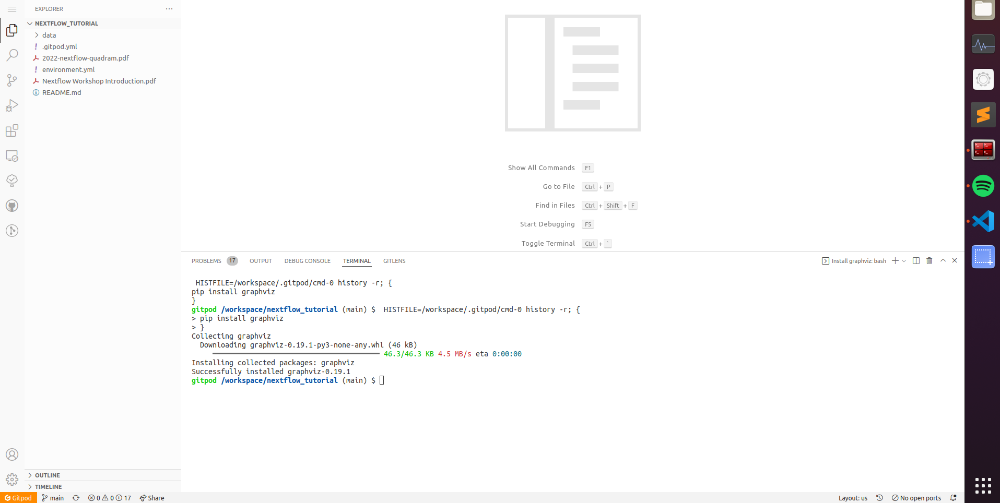

# [Nextflow Tutorial - Variant Calling Edition](https://sateeshperi.github.io/nextflow_varcal/nextflow/)

## Gitpod environment

Use a preconfigured Nextflow development environment using Gitpod.

>Requirements:
>* A GitHub, GitLab or BitBucket account (gives you 50 hours usage per month)
>* Web browser (Google Chrome, Firefox)

To run Gitpod:

1) click the following URL:

gitpod.io/#https://github.com/sateeshperi/nextflow_tutorial.git

(which is our Github repository URL, prefixed with `gitpod.io/#`).

OR

2) click the button below to launch directly as well

[](https://gitpod.io/#https://github.com/sateeshperi/nextflow_tutorial.git)

OR

3) Install the Gitpod browser extension, following the instructions **[here](https://www.gitpod.io/docs/browser-extension)**. This will add a green Gitpod button to each Git repository for easy access to the environment. Then go to the git repository for the training (https://github.com/sateeshperi/nextflow_tutorial.git), and click the green button.


* Login to your Github account (and allow authorization).
* You may need to close the window at each stage and click the gitpod link again.
* For BitBucket or GitLab, you may have to sign into Gitpod and change your integration on the following page: [gitpod.io/integrations](https://gitpod.io/integrations).

Once you have signed in, gitpod will load (skip prebuild, if asked):


* Gitpod gives you 50 hours per month to run the environment, with up to 4 parallel workspaces at a time. So feel free to come back at any time and try the course at your own pace.

* It is useful to save the URL that is now your Gitpod environment. Later, we can use this to return to the same closed environment (so please take note of it now).

> Explore your Gitpod IDE

You should see something similar to the following:



* The sidebar allows you to customize your Gitpod environment and perform basic tasks (Copy/Paste, Open files, search, git, etc.) Click the **Explorer** button to see which files are in this repository.

* The terminal allows you to run all the programs in the repository, for example **nextflow, conda and docker are installed**.

* The main window allows you to view and edit files. Clicking on a file in the explorer will open it within the main window.

> To save your files, choose your file of interest, then either use the left/top hand side bar (File/Save As…​) or use you’re keyboard shortcut to save as (On Mac: `CMD, shift, s`), then choose Show local. This will open up a explorer to choose where to save your file on your local machine.

* **The GitPod comes with Nextflow, Conda and Docker pre-installed**

### 1. Create `varcal` environment based on yml file

```bash
mamba env update -n base -f environment.yml
```

### 2. Download reference genome and raw reads

```bash
bash data/fetch_raw_data.sh
```

### 3. Trim raw reads using `trimmomatic`

```bash
bash data/trim.sh
```

## Reopening a Gitpod session

* Any running workspace will be automatically stopped after 30 minutes. You can open the environment again by going to `gitpod.io/workspaces` and finding your previous environment, then clicking the three dot button to the right, and selecting Open.

* If you save the URL from your previous Gitpod environment, you can just paste this into your browser to open the previous environment. Environments are saved for up to two weeks, but don’t rely on their existence, download any important files you want for posterity.

* Alternatively, you can start a new workspace by clicking the green gitpod button, or following the Gitpod URL: gitpod.io/#https://gitpod.io/#https://github.com/sateeshperi/nextflow_tutorial.git

---
---
