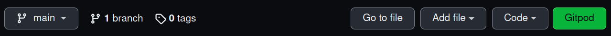



<hr>
<center>This chapter is a part of <a href="/nextflow_varcal/docs/nextflow/" target="_blank">Introduction to NextFlow</a>.</center>
<hr>

<br>

## Using Gitpod for a Preconfigured Nextflow Development Environment

Gitpod provides a cloud-based development environment that can be accessed through your web browser. This environment is ideal for running Nextflow and is preconfigured for your convenience.

**Requirements:**

- A GitHub, GitLab, or BitBucket account (provides 50 hours of usage per month)
- A web browser (Google Chrome or Firefox)

## Accessing the Gitpod Environment

To access the Gitpod environment:

1. Prefix the Github repository URL with `gitpod.io/#`. For example:

   `gitpod.io/#https://github.com/sateeshperi/nextflow_tutorial.git`

2. Alternatively, click the button below to launch directly:

   [](https://gitpod.io/#https://github.com/sateeshperi/nextflow_tutorial.git)

3. Install the Gitpod browser extension by following the instructions [here](https://www.gitpod.io/docs/browser-extension). This will add a green Gitpod button to each Git repository for easy access. Once installed, navigate to the training repository (https://github.com/sateeshperi/nextflow_tutorial.git), and click the green button.



Sign in to your Github account and authorize Gitpod. If using BitBucket or GitLab, sign into Gitpod and change your integration on the following page: [gitpod.io/integrations](https://gitpod.io/integrations).

Once signed in, Gitpod will load (skip prebuild, if asked). Remember to save the URL of your Gitpod environment for future access.

## Exploring the Gitpod IDE

The Gitpod environment comes with a sidebar for customizing your environment and performing basic tasks, a terminal for running programs, and a main window for viewing and editing files. The environment comes preinstalled with Nextflow, Conda, and Docker.

To save your files, choose your file of interest, then either use the sidebar to select "File/Save As…", or use your keyboard shortcut to save as, then choose "Show local". This will open an explorer to choose where to save your file on your local machine.

## Setting Up Your Workspace

1. Create the `varcal` environment based on the `yml` file:

   ```bash
   mamba env update -n base -f environment.yml
   ```

2. Download the reference genome and raw reads:

   ```bash
   bash data/fetch_raw_data.sh
   ```

3. Trim raw reads using `trimmomatic`:

   ```bash
   bash data/trim.sh
   ```

## Reopening a Gitpod Session

Running workspaces are automatically stopped after 30 minutes of inactivity. You can reopen the environment by going to `gitpod.io/workspaces`, finding your previous environment, clicking the three-dot button to the right, and selecting "Open".

You can also reopen a previous environment by using the saved URL from your previous Gitpod environment. Environments are saved for up to two weeks.

Alternatively, you can start a new workspace by clicking the green Gitpod button or using the Gitpod URL: `gitpod.io/#https://github.com/sateeshperi/nextflow_tutorial.git`.

 <br>

<details>
  <summary><b>CLICK HERE for Manual Install Instructions</b></summary>

### Nextflow Requirements

- Nextflow can be used on any POSIX compatible system (Linux, OS X, etc). It requires Bash 3.2 (or later) and [Java 8 (or later, up to 15)](http://www.oracle.com/technetwork/java/javase/downloads/index.html) to be installed.
- For the execution in a cluster of computers the use a shared file system is required to allow the sharing of tasks input/output files.
- Windows system is supported through WSL.
- Nextflow is distributed as a self-installing package, which means that it does not require any special installation procedure. Installation instructions can be found [here](https://www.nextflow.io/docs/latest/getstarted.html#installation)

<pre>
mkdir -p ~/bin/
cd ~/bin/
curl -s https://get.nextflow.io | bash
chmod +x nextflow
echo 'PATH=~/bin:$PATH' >> ~/.bashrc
which nextflow      ## should point back to ~/bin
nextflow -v         ## check install by invoking Nextflow, getting version
</pre>

## NF-CORE Install

<pre>
conda install nf-core
# or
pip install nf-core
</pre>

## Environment Setup

- Create `environment.yml`
<pre>
channels:

* bioconda
* conda-forge
  dependencies:
* fastqc
* trimmomatic
* bwa
* samtools
* bcftools
* multiqc
* graphviz
</pre>

<pre>
mamba env create -n varcal -f environment.yml
</pre>

## Data Download & Setup

The data for this tutorial is sourced from the [DataCarpentry Wrangling Genomics Lesson](https://datacarpentry.org/wrangling-genomics/02-quality-control/index.html).

- **Download the Reference Genome**

<pre>
cd ~/
mkdir -p nextflow_tutorial/data/ref_genome
cd nextflow_tutorial/data/ref_genome
curl -L -o ecoli_rel606.fasta.gz ftp://ftp.ncbi.nlm.nih.gov/genomes/all/GCA/000/017/985/GCA_000017985.1_ASM1798v1/GCA_000017985.1_ASM1798v1_genomic.fna.gz
gunzip ecoli_rel606.fasta.gz
ls
</pre>

- **Download Raw Data**

<pre>
cd ~/
mkdir -p nextflow_tutorial/data/untrimmed_fastq/
cd nextflow_tutorial/data/untrimmed_fastq/

curl -O ftp://ftp.sra.ebi.ac.uk/vol1/fastq/SRR258/004/SRR2589044/SRR2589044_1.fastq.gz
curl -O ftp://ftp.sra.ebi.ac.uk/vol1/fastq/SRR258/004/SRR2589044/SRR2589044_2.fastq.gz
curl -O ftp://ftp.sra.ebi.ac.uk/vol1/fastq/SRR258/003/SRR2584863/SRR2584863_1.fastq.gz
curl -O ftp://ftp.sra.ebi.ac.uk/vol1/fastq/SRR258/003/SRR2584863/SRR2584863_2.fastq.gz
curl -O ftp://ftp.sra.ebi.ac.uk/vol1/fastq/SRR258/006/SRR2584866/SRR2584866_1.fastq.gz
curl -O ftp://ftp.sra.ebi.ac.uk/vol1/fastq/SRR258/006/SRR2584866/SRR2584866_2.fastq.gz
</pre>

- **Trim the Reads**

  Activate your conda environment:

<pre>
  conda activate varcal
</pre>

Then run the trimming:

<pre>
  cd nextflow_tutorial/data/untrimmed_fastq/

  for infile in *_1.fastq.gz
  do
     base=$(basename ${infile} _1.fastq.gz)
     trimmomatic PE ${infile} ${base}_2.fastq.gz \
                  ${base}_1.trim.fastq.gz ${base}_1un.trim.fastq.gz \
                  ${base}_2.trim.fastq.gz ${base}_2un.trim.fastq.gz \
                  SLIDINGWINDOW:4:20 MINLEN:25 ILLUMINACLIP:NexteraPE-PE.fa:2:40:15
  done
</pre>

Now move the trimmed files to a new directory:

<pre>
  mkdir ../trimmed_fastq
  mv *.trim* ../trimmed_fastq
  cd ../trimmed_fastq
  ls
</pre>

## Integrated Development Environment (IDE)

The choice of IDE will not be covered in this tutorial. You can use the one you are most comfortable with, as you will need to edit text files as well as run commands from the terminal. At some point, you will also need to run these commands from a cluster node.

Some good options include Visual Studio Code, which supports Nextflow plugins and the remote-ssh module. This setup, however, is beyond the scope of this tutorial.

- [Download Visual Studio Code](https://code.visualstudio.com/Download)
- [VSCode Nextflow Plugin](https://marketplace.visualstudio.com/items?itemName=nextflow.nextflow)
- [VSCode Remote-SSH Plugin](https://marketplace.visualstudio.com/items?itemName=ms-vscode-remote.remote-ssh)

Remember, you can choose the IDE that best suits your comfort level and requirements. The most important thing is that it allows you to effectively write and debug your Nextflow scripts.

</details>

---

<h5><a href="/nextflow_varcal/docs/nextflow/index" style="float: left"><b>Back to:</b>Table of Contents</a>

<a href="/nextflow_varcal/docs/nextflow/nextflow_intro" style="float: right"><b>Next:</b>Nextflow Introduction</a></h5>
