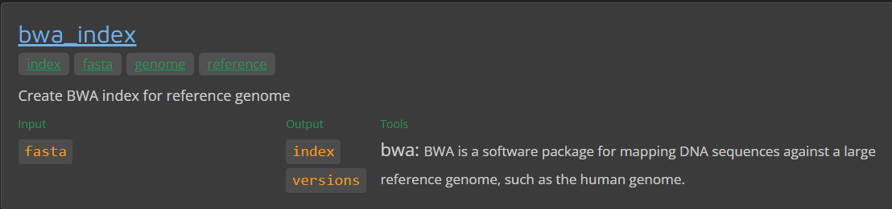



<hr>
<center>This is part 15 of <a href="/nextflow_varcal/docs/nextflow/" target="_blank">Introduction to NextFlow</a>.</center>
<hr>

<br>

## NF-Core VariantCall


## Using the nf-core template

Indeed, the core principle of nf-core is the standardization of pipeline code structure. By adhering to a generalized pipeline template, all pipelines maintain a consistent design. If you're looking to build a new nf-core pipeline, the best starting point is this template, which can be accessed via the `nf-core create` command.

The `nf-core create` command sets up a new Nextflow pipeline in nf-core style, pre-loaded with nf-core templates and configurations. This provides a strong, standardized foundation upon which you can build your specific pipeline.

Here's how you can use the command:

```bash
nf-core create
```

- After running this command, You will prompted to enter `Workflow Name`, `Description`, `Author`.
- You will also be asked `if you want to customize which parts of the template are used`. Enter 'No' for now (but, feel free to explore which parts of the template can be customized).
  This will Initialise a pipeline git repository in your current directory. Once you've provided these details, the command will generate a new pipeline directory with all the necessary files and structure in place, following nf-core guidelines.

> ```bash
>                                          ,--./,-.
>          ___     __   __   __   ___     /,-._.--~\
>    |\ | |__  __ /  ` /  \ |__) |__         }  {
>    | \| |       \__, \__/ |  \ |___     \`-._,-`-,
>                                          `._,._,'
>
>    nf-core/tools version 2.8 - https://nf-co.re
>
>
> ? Workflow name variantcall
> ? Description simple variant calling pipeline
> ? Author sateesh peri
> ? Do you want to customize which parts of the template are used? No
> INFO     Creating new nf-core pipeline: 'nf-core/variantcall'
> INFO     Initialising pipeline git repository
> INFO     Done. Remember to add a remote and push to GitHub:
>          cd /home/speri/github/test_slack/nf-core-variantcall
>          git remote add origin git@github.com:USERNAME/REPO_NAME.git
>          git push --all origin
> INFO     This will also push your newly created dev branch and the TEMPLATE branch for
>         syncing.
> INFO     !!!!!! IMPORTANT !!!!!!
>
>         If you are interested in adding your pipeline to the nf-core community,
>         PLEASE COME AND TALK TO US IN THE NF-CORE SLACK BEFORE WRITING ANY CODE!
>
>         Please read: https://nf-co.re/developers/>adding_pipelines#join-the-community
> ```

```bash
cd nf-core-variantcall/
ls
```

## NF-Core Modules

NF-Core Modules are a key feature of the nf-core ecosystem, leveraging the modularity provided by Nextflow's DSL2 syntax. This allows workflows, subworkflows, and modules to be defined and imported into a pipeline. This modular structure promotes the reuse and sharing of pipeline processes among nf-core pipelines.

- **[NF-Core Modules](https://nf-co.re/modules)**



The shared modules are stored in the **[nf-core/modules](https://github.com/nf-core/modules)** repository. The modules in this repository are designed to be as atomic as possible, generally encapsulating a single tool. If a tool consists of several subtools (e.g., `bwa index` and `bwa mem`), these are stored in individual modules, following the naming convention `tool/subtool`.

Each module defines the input and output channels, the process script, and the software packaging for a specific process. Conda environments, Docker or Singularity containers are defined within each module. Most of these modules rely on the [biocontainers](https://biocontainers.pro/) project, which provides single-tool containers for each module.

The `nf-core/modules` repository also includes tests for each module. These tests run on minimal test data from the `nf-core/test-datasets` repository (modules branch). These module tests run similarly to pipeline tests on GitHub actions, ensuring that modules are always functional and produce the desired results.

NF-core tools include a series of subcommands for working with nf-core modules.

- To list all the modules available in the `nf-core/modules` repository, use the following command:

```bash
nf-core modules list remote
```

- To list all the currently installed modules in your local pipeline, use:

```bash
nf-core modules list local
```

This modular approach significantly improves the maintainability and scalability of nf-core pipelines, promoting code reuse and standardization across different pipelines.

> The template pipeline comes with `fastqc`, `multiqc` and `custom/dumpsoftwareversions` pre-installed

```bash

                                          ,--./,-.
          ___     __   __   __   ___     /,-._.--~\
    |\ | |__  __ /  ` /  \ |__) |__         }  {
    | \| |       \__, \__/ |  \ |___     \`-._,-`-,
                                          `._,._,'

    nf-core/tools version 2.8 - https://nf-co.re


INFO     Modules installed in '.':

┏━━━━━━━━━━━━━━━━━┳━━━━━━━━━━━━━━━━━━┳━━━━━━━━━━━━━━━━━┳━━━━━━━━━━━━━━━━━━┳━━━━━━━━━━━━┓
┃ Module Name     ┃ Repository       ┃ Version SHA     ┃ Message          ┃ Date       ┃
┡━━━━━━━━━━━━━━━━━╇━━━━━━━━━━━━━━━━━━╇━━━━━━━━━━━━━━━━━╇━━━━━━━━━━━━━━━━━━╇━━━━━━━━━━━━┩
│ custom/dumpsof… │ https://github.… │ 76cc4938c1f6ea… │ give execution   │ 2023-04-28 │
│                 │                  │                 │ permissions to   │            │
│                 │                  │                 │ dumpsoftwarever… │            │
│                 │                  │                 │ (#3347)          │            │
│ fastqc          │ https://github.… │ c8e35eb2055c09… │ Bulk change      │ 2022-12-13 │
│                 │                  │                 │ conda syntax for │            │
│                 │                  │                 │ all modules      │            │
│                 │                  │                 │ (#2654)          │            │
│ multiqc         │ https://github.… │ f2d63bd5b68925… │ fix meta.ymls    │ 2023-04-28 │
│                 │                  │                 │ for dumpsoftware │            │
│                 │                  │                 │ and multiqc      │            │
│                 │                  │                 │ (#3345)          │            │
└─────────────────┴──────────────────┴─────────────────┴──────────────────┴────────────┘
```

- Create a samplesheet from untrimmed-reads: `samplesheet.csv` paste the following and save

```bash
sample,fastq_1,fastq_2
SRR2584863,/workspace/nextflow_tutorial/data/untrimmed_fastq/SRR2584863_1.fastq.gz,/workspace/nextflow_tutorial/data/untrimmed_fastq/SRR2584863_2.fastq.gz
SRR2584866,/workspace/nextflow_tutorial/data/untrimmed_fastq/SRR2584866_1.fastq.gz,/workspace/nextflow_tutorial/data/untrimmed_fastq/SRR2584866_2.fastq.gz
SRR2589044,/workspace/nextflow_tutorial/data/untrimmed_fastq/SRR2589044_1.fastq.gz,/workspace/nextflow_tutorial/data/untrimmed_fastq/SRR2589044_2.fastq.gz
```

- Change the `max_memory` and `max_cpus` available in `nextflow.config` file:

```groovy
max_memory = '6.GB'
max_cpus   = 4
```

- To run the workflow with `fastqc`, `multiqc` and `dumpsoftwareversions` processes

```bash
nextflow run main.nf --input samplesheet.csv --fasta /workspace/nextflow_tutorial/data/ref_genome/ecoli_rel606.fasta -profile docker
```

> ```bash
> N E X T F L O W  ~  version 21.10.6
> Launching `main.nf` [admiring_torvalds] - revision: 55a600f0ab
>
>
> ------------------------------------------------------
>                                        ,--./,-.
>        ___     __   __   __   ___     /,-._.--~'
>  |\ | |__  __ /  ` /  \ |__) |__         }  {
>  | \| |       \__, \__/ |  \ |___     \`-._,-`-,
>                                        `._,._,'
>  nf-core/variantcall v1.0dev
> ------------------------------------------------------
> Core Nextflow options
>  runName        : admiring_torvalds
>  containerEngine: docker
>  launchDir      : /workspace/nextflow_tutorial/nf-core-variantcall
>  workDir        : /workspace/nextflow_tutorial/nf-core-variantcall/work
>  projectDir     : /workspace/nextflow_tutorial/nf-core-variantcall
>  userName       : gitpod
>  profile        : docker
>  configFiles    : /workspace/nextflow_tutorial/nf-core-variantcall/nextflow.config
>
> Input/output options
>  input          : samplesheet.csv
>
> Reference genome options
>  fasta          : /workspace/nextflow_tutorial/data/ref_genome/ecoli_rel606.fasta
>
> Max job request options
>  max_cpus       : 4
>  max_memory     : 12.GB
>
> !! Only displaying parameters that differ from the pipeline defaults !!
> ------------------------------------------------------
> If you use nf-core/variantcall for your analysis please cite:
>
> * The nf-core framework
>  https://doi.org/10.1038/s41587-020-0439-x
>
> * Software dependencies
>  https://github.com/nf-core/variantcall/blob/master/CITATIONS.md
> ------------------------------------------------------
> executor >  local (6)
> [60/43ab20] process > NFCORE_VARIANTCALL:VARIANTCALL:INPUT_CHECK:SAMPLESHEET_CHECK (samplesheet.csv) [100%] 1 of 1 ✔
> [27/2aadda] process > NFCORE_VARIANTCALL:VARIANTCALL:FASTQC (SRR2589044_T1)                          [100%] 3 of 3 ✔
> [26/e03e88] process > NFCORE_VARIANTCALL:VARIANTCALL:CUSTOM_DUMPSOFTWAREVERSIONS (1)                 [100%] 1 of 1 ✔
> [de/019672] process > NFCORE_VARIANTCALL:VARIANTCALL:MULTIQC                                         [100%] 1 of 1 ✔
> -[nf-core/variantcall] Pipeline completed successfully-
> WARN: To render the execution DAG in the required format it is required to install Graphviz -- See http://www.graphviz.org for more info.
> Completed at: 21-Feb-2022 14:46:30
> Duration    : 1m 55s
> CPU hours   : 0.1
> Succeeded   : 6
> ```

- To clean any previous nextflow runs:

```bash
rm -fr results/ work/ .nextflow .nextflow.log*
```

## Adding nf-core modules to a pipeline

To filter the search:

```bash
nf-core modules list remote | grep bwa
nf-core modules list remote | grep samtools
nf-core modules list remote | grep bcftools
```

Adding nf-core modules to a pipeline, if the modules already exist in the nf-core modules repository, can be done with the following command (executing it in the main pipeline directory):

> ```bash
> nf-core modules install <module name>
> ```

```bash
nf-core modules install bwa/index
```

```bash
                                          ,--./,-.
          ___     __   __   __   ___     /,-._.--~\
    |\ | |__  __ /  ` /  \ |__) |__         }  {
    | \| |       \__, \__/ |  \ |___     \`-._,-`-,
                                          `._,._,'

    nf-core/tools version 2.8 - https://nf-co.re


INFO     Installing 'bwa/index'
INFO     Use the following statement to include this module:

 include { BWA_INDEX } from '../modules/nf-core/bwa/index/main'
```

```bash
nf-core modules install bwa/mem
```

```bash
                                          ,--./,-.
          ___     __   __   __   ___     /,-._.--~\
    |\ | |__  __ /  ` /  \ |__) |__         }  {
    | \| |       \__, \__/ |  \ |___     \`-._,-`-,
                                          `._,._,'

    nf-core/tools version 2.8 - https://nf-co.re


INFO     Installing 'bwa/mem'
INFO     Use the following statement to include this module:

 include { BWA_MEM } from '../modules/nf-core/bwa/mem/main'
```

```bash
nf-core modules install samtools/sort
```

```bash
nf-core modules install samtools/index
```

```bash
nf-core modules install bcftools/mpileup
```

NF-core modules are stored under the `modules/nf-core` directory. To use these modules in your main pipeline workflow (e.g., `workflows/<pipeline-name>.nf`) or a sub-workflow, you need to include them in the corresponding Nextflow file using the `include` statement:

```bash
include { TOOL_SUBTOOL } from '../modules/nf-core/modules/<tool/subtool>/main'
```

For example, if you're working with a pipeline named `nf-core-variantcall`, you could add the following includes in your `nf-core-variantcall/workflows/variantcall.nf`:

```groovy
include { BWA_INDEX     } from '../modules/nf-core/modules/bwa/index/main'
include { BWA_MEM       } from '../modules/nf-core/modules/bwa/mem/main'
include { SAMTOOLS_SORT } from '../modules/nf-core/modules/samtools/sort/main'
include { SAMTOOLS_INDEX } from '../modules/nf-core/modules/samtools/index/main'
include { BCFTOOLS_MPILEUP } from '../modules/nf-core/modules/bcftools/mpileup/main'
```

Then, within the workflow scope of the same `variantcall.nf` file, you can call these modules as follows:

```groovy
//
// MODULE: Run BWA-INDEX
//

BWA_INDEX(params.fasta)

//
// MODULE: Run BWA-ALIGN
//

BWA_MEM(INPUT_CHECK.out.reads, BWA_INDEX.out.index, "view")

//
// MODULE: Run SAMTOOLS-SORT
//

SAMTOOLS_SORT(BWA_MEM.out.bam)

//
// MODULE: Run SAMTOOLS-INDEX
//

SAMTOOLS_INDEX(SAMTOOLS_SORT.out.bam)
```

Module-specific options, like tool options, can be defined in the `nf-core-variantcall/conf/modules.config` configuration file. For instance, you might want to add the following configuration to the `modules.config` file:

```bash
withName: SAMTOOLS_SORT {
  ext.prefix = "sorted"
}
```

Once you've set up your pipeline with the appropriate modules and configurations, you can run the pipeline using the `nextflow run` command:

```bash
nextflow run main.nf --input samplesheet.csv --fasta /workspace/nextflow_tutorial/data/ref_genome/ecoli_rel606.fasta -profile docker
```

This command instructs Nextflow to run your pipeline (defined in `main.nf`), specifying input and reference fasta file locations, and telling it to use Docker containers for software dependencies (with `-profile docker`).

> Output
>
> ```bash
> N E X T F L O W  ~  version 21.10.6
> Launching `main.nf` [magical_einstein] - revision: 55a600f0ab
>
>
> ------------------------------------------------------
>                                        ,--./,-.
>        ___     __   __   __   ___     /,-._.--~'
>  |\ | |__  __ /  ` /  \ |__) |__         }  {
>  | \| |       \__, \__/ |  \ |___     \`-._,-`-,
>                                        `._,._,'
>  nf-core/variantcall v1.0dev
> ------------------------------------------------------
> Core Nextflow options
>  runName        : magical_einstein
>  containerEngine: docker
>  launchDir      : /workspace/nextflow_tutorial/nf-core-variantcall
>  workDir        : /workspace/nextflow_tutorial/nf-core-variantcall/work
>  projectDir     : /workspace/nextflow_tutorial/nf-core-variantcall
>  userName       : gitpod
>  profile        : docker
>  configFiles    : /workspace/nextflow_tutorial/nf-core-variantcall/nextflow.config
>
> Input/output options
>  input          : samplesheet.csv
>
> Reference genome options
>  fasta          : /workspace/nextflow_tutorial/data/ref_genome/ecoli_rel606.fasta
>
> Max job request options
>  max_cpus       : 4
>  max_memory     : 6.GB
>
> !! Only displaying parameters that differ from the pipeline defaults !!
> ------------------------------------------------------
> If you use nf-core/variantcall for your analysis please cite:
>
> * The nf-core framework
>  https://doi.org/10.1038/s41587-020-0439-x
>
> * Software dependencies
>  https://github.com/nf-core/variantcall/blob/master/CITATIONS.md
> ------------------------------------------------------
> executor >  local (16)
> [3f/2fccb5] process > NFCORE_VARIANTCALL:VARIANTCALL:INPUT_CHECK:SAMPLESHEET_CHECK (samplesheet.csv) [100%] 1 of 1 ✔
> [23/776fe6] process > NFCORE_VARIANTCALL:VARIANTCALL:FASTQC (SRR2584863_T1)                          [100%] 3 of 3 ✔
> [2e/2d108b] process > NFCORE_VARIANTCALL:VARIANTCALL:CUSTOM_DUMPSOFTWAREVERSIONS (1)                 [100%] 1 of 1 ✔
> [59/7e75bb] process > NFCORE_VARIANTCALL:VARIANTCALL:BWA_INDEX (ecoli_rel606.fasta)                  [100%] 1 of 1 ✔
> [ce/50d7ee] process > NFCORE_VARIANTCALL:VARIANTCALL:BWA_MEM (SRR2584866_T1)                         [100%] 3 of 3 ✔
> [56/dae396] process > NFCORE_VARIANTCALL:VARIANTCALL:SAMTOOLS_SORT (SRR2584866_T1)                   [100%] 3 of 3 ✔
> [90/5ac8a9] process > NFCORE_VARIANTCALL:VARIANTCALL:SAMTOOLS_INDEX (SRR2584866_T1)                  [100%] 3 of 3 ✔
> [40/2df600] process > NFCORE_VARIANTCALL:VARIANTCALL:MULTIQC                                         [100%] 1 of 1 ✔
> -[nf-core/variantcall] Pipeline completed successfully-
> WARN: To render the execution DAG in the required format it is required to install Graphviz -- See http://www.graphviz.org for more info.
> Completed at: 04-Mar-2022 01:57:43
> Duration    : 5m 30s
> CPU hours   : 0.3
> Succeeded   : 16
> ```

---

<h5><a href="/nextflow_varcal/docs/nextflow/nextflow_caching" style="float: left"><b>Back to:</b>NextFlow Caching</a>

<a href="/nextflow_varcal/docs/nextflow/nextflow_nfcore_module_create" style="float: right"><b>Next:</b>Contributing to nf-core/modules</a></h5>
