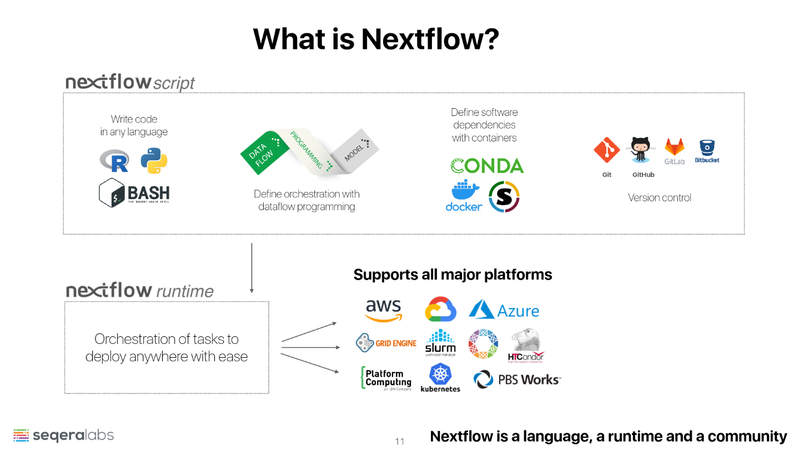

 

*   **Nextflow** is a workflow management system that enables the writing of scalable and reproducible scientific workflows. 
*   It can integrate various software package and environment management systems such as **Docker**, **Singularity**, and **Conda**. It allows for existing pipelines written in common scripting languages, such as BASH, R and Python, to be seamlessly coupled together. 
*   Nextflow simplifies the implementation and running of workflows on cloud or high-performance computing (HPC) infrastructures.
*   Nextflow is backed by **nf-core**: a community-driven platform, which provides **peer-reviewed** best practice analysis pipelines.

>**Pre-Requisites**
>*  This lesson assumes a working understanding of the command line, familiarity with Conda, Docker/Singularity and running jobs on HPC cluster.
>
>*  This lesson also assumes some familiarity with biological concepts, including the structure of DNA, nucleotide abbreviations, and the concept of genomic variation within a population.

## Schedule & Learning Objectives

| Chapter | Learning Objectives |
| --- | --- |
| **Session - 1** | **3 hours** |
|0. [Setup](/nextflow_varcal/nextflow/nextflow_install) | GitPod Link & Setup |
|                                                       | How to install Nextflow? |
|                                                       | Data & Environment Setup |
|1. [Nextflow Introduction](/nextflow_varcal/nextflow/nextflow_intro) | What is a workflow and what are workflow management systems? |
|                                                     | Why should I use a workflow management system? |
|                                                     | What is Nextflow? |
|                                                     | What are the main features of Nextflow? |
|                                                     | What are the main components of a Nextflow script? |
|                                                     | How do I run a Nextflow script? |
|                                                     | How can I use the nextflow logs? |
|2. [NF-Core](/nextflow_varcal/nextflow/nextflow_nfcore) | Where can I find existing bioinformatic pipelines? |
|                                        | What is nf-core tools? |
|                                        | How do you run nf-core pipelines? |
|                                        | How do you configure nf-core pipelines? |
|                                        | How do you use nf-core pipelines offline? |
|3. [NF-Core @ HPC](/nextflow_varcal/nextflow/nextflow_slurm) | How do I configure nf-core pipelines to submit jobs to HPC cluster |
| --- | --- |
| **Session - 2** | **3 hours** |
|4. [Nextflow-Scripting](/nextflow_varcal/nextflow/nextflow_scripting) | What language are Nextflow scripts written in? |
|                                                      | How do I store values in a Nextflow script? |
|                                                      | How do I write comments Nextflow script? |
|                                                      | How can I store and retrieve multiple values? |
|                                                      | How are strings evaluated in Nextflow? |
|                                                      | How can I create simple re-useable code blocks? |
|5. [Nextflow-Channels](/nextflow_varcal/nextflow/nextflow_channels) | How do I get data into Nextflow? |
|                                                    | How do I handle different types of input, e.g. files and parameters? |
|                                                    | How do I create a Nextflow Channel? |
|                                                    | How can I use pattern matching to select input files? |
|                                                    | How do I change the way inputs are handled? |
|6. [Nextflow-Processes](/nextflow_varcal/nextflow/nextflow_processes) | How do I run tasks/processes in Nextflow? |
|                                                      | How do I pass parameters to a Nextflow script on the command line? |
|                                                      | How do I get data, files and values, into and out of processes? |
|                                                      | How do can I control when a process is executed? |
|                                                      | How do I control resources, such as number of CPUs and memory, available to processes? |
|                                                      | How do I save output/results from a process? |
|7. [Nextflow-Workflow](/nextflow_varcal/nextflow/nextflow_workflow) | How do I connect channels and processes to create a workflow? |
|                                                    | How do I invoke a process inside a workflow? |
|8. [Nextflow-Operators](/nextflow_varcal/nextflow/nextflow_operators) | How do I perform operations, such as filtering, on channels? |
|                                                      | What are the different kinds of operations I can perform on channels? |
|                                                      | How do I combine operations? |
|                                                      | How can I use a CSV file to process data into a Channel? |
| --- | --- |
| **Session - 3** | **3 hours** |
|9. [Simple Variant-Calling pipeline](/nextflow_varcal/nextflow/nextflow_variant_calling) | How can I create a variant calling pipeline? |
|                                                                          | How do I print all the pipeline parameters by using a single command? |
|                                                                          | How can I use conda with my pipeline? |
|                                                                          | How do I know when my pipeline has finished? |
|                                                                          | How do I see runtime metrics and execution information? |
|10. [Nextflow configuration](/nextflow_varcal/nextflow/nextflow_configuration) | What is the difference between the workflow implementation and the workflow configuration? |
|                                                              | How do I configure a Nextflow workflow? |
|                                                              | How do I assign different resources to different processes? |
|                                                              | How do I separate and provide configuration for different computational systems? |
|                                                              | How do I change configuration settings from the default settings provided by the workflow? |
|11. [Nextflow-Modules](/nextflow_varcal/nextflow/nextflow_modules) | How can I reuse a Nextflow process in different workflows? |
|                                                   | How do I use parameters in a module? |
|12. [Nextflow-Sub-workflows](/nextflow_varcal/nextflow/nextflow_sub_workflows) | How do I reuse a workflow as part of a larger workflow? |
|                                                               | How do I run only a part of a workflow? |
|13. [Nextflow-Reporting](/nextflow_varcal/nextflow/nextflow_reporting) | How do I get information about my pipeline run? |
|                                                       | How can I see what commands I ran? |
|                                                       | How can I create a report from my run? |
|14. [Workflow caching and checkpointing](/nextflow_varcal/nextflow/nextflow_caching) | How can I restart a Nextflow workflow after an error? |
|                                                                     | How can I add new data to a workflow? |
|                                                                     | Where can I find intermediate data and results? |
|15. [nf-core/variantcall](/nextflow_varcal/nextflow/nextflow_nfcore_variantcall) | Assembling the variant-calling workflow nf-core style  |
|                                                                     | How can I add nf-core modules? |
| --- | --- |
| [Nextflow Useful Links](/nextflow_varcal/nextflow/nextflow_useful) |   |

## Editors

*   `Sateesh Peri`
*   `Michael Cipriano`

## Credits

*   **[Introduction to Bioinformatics workflows with Nextflow and nf-core](https://carpentries-incubator.github.io/workflows-nextflow/index.html)**

> Graeme R. Grimes, Evan Floden, Paolo Di Tommaso, Phil Ewels and Maxime Garcia 
Introduction to Workflows with Nextflow and nf-core.
https://github.com/carpentries-incubator/workflows-nextflow 2021.

*   **[Data Carpentry: Wrangling Genomics Lesson](https://datacarpentry.org/wrangling-genomics/)**

> Josh Herr, Ming Tang, Lex Nederbragt, Fotis Psomopoulos (eds): "Data Carpentry: Wrangling Genomics Lesson."
Version 2017.11.0, November 2017,
http://www.datacarpentry.org/wrangling-genomics/, doi: 10.5281/zenodo.1064254

---
 
