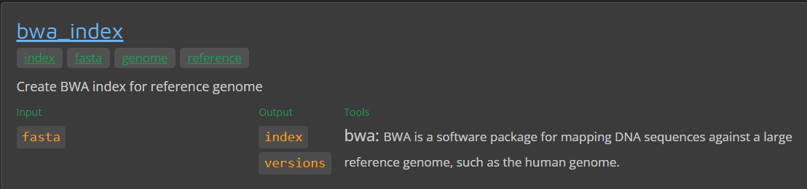




<hr>
<center>This is part 11 of 14 of a <a href="/nextflow_varcal/nextflow/" target="_blank">Introduction to NextFlow</a>.</center>
<hr>

<br>

## Modules

The features offered by Nextflow DSL2 can be used in various ways depending on the granularity with which you would like to write pipelines. 

> **MODULE** - A `process` that can be used within different pipelines and is as atomic as possible i.e. cannot be split into another module. An example of this would be a module file containing the process definition for a single tool such as `FastQC`. At present, this repository has been created to only host atomic module files that should be added to the [modules/](https://github.com/nf-core/modules/tree/master/modules) directory of `nf-core/modules` along with the required documentation and tests.

* In most programming languages there is the concept of creating code blocks/modules that can be reused.

* Nextflow (DSL2) allows the definition of module scripts that can be included and shared across workflow pipelines.

* A module file is nothing more than a Nextflow script containing one or more process definitions that can be imported from another Nextflow script.

* A module can contain the definition of a function, process and workflow definitions.

```bash
mkdir modules
cd modules
```


*   Create a new file `fastqc.nf` in the current modules directory; paste the following and save.

>```bash
>/*
>========================================================================================
>    FASTQC module
>========================================================================================
>    Website: https://www.bioinformatics.babraham.ac.uk/projects/fastqc/
>========================================================================================
>*/
>
>// Parameter definitions
>params.CONTAINER = "quay.io/biocontainers/fastqc:0.11.9--0"
>params.OUTPUT = "trim_fastqc_output"
>
>process FASTQC {
>    
>    // where to store the results and in which way
>    publishDir( params.OUTPUT, mode: 'copy' ) 
>
>    // indicates to use as container the value indicated in the parameter
>    container( params.CONTAINER )
>
>    // show in the log which input file is analysed
>    tag( "${reads}" )
>    
>    input:
>    tuple val( sample_id ), path( reads )
>
>    output:
>    path( "*_fastqc*" ), emit: fastqc_out
>
>    script:
>    """
>    fastqc ${reads}
>    """
>}
>```

*   Create a new file `bwa_index.nf` in the current modules directory; paste the following and save.

>```bash
>/*
>========================================================================================
>    BWA-INDEX module
>========================================================================================
>    Website: http://www.htslib.org/doc/samtools.html
>========================================================================================
>*/
>
> // Parameter definitions
>params.CONTAINER = "quay.io/biocontainers/bwa:0.7.17--hed695b0_7"
>params.OUTPUT = "bwa_index"
>
>process BWA_INDEX {
>  
>  // where to store the results and in which way
>  publishDir( params.OUTPUT, mode: 'copy' )
>    
>  // indicates to use as container the value indicated in the parameter
>  container( params.CONTAINER )
>  
>  // show in the log which input file is analysed
>  tag( "${genome}" )
>  
>  input:
>  path( genome )
>
>  output:
>  tuple path( genome ), path( "*" ), emit: bwa_index
>
>  script:
>  """
>  bwa index ${genome} 
>  """
>}
>```

*   Create a new file `bwa_align.nf` in the current modules directory; paste the following and save.

>```bash
>/*
>========================================================================================
>    BWA-ALIGN module
>========================================================================================
>    Website: http://bio-bwa.sourceforge.net/
>========================================================================================
>*/
>
> // Parameter definitions
>params.CONTAINER = "quay.io/biocontainers/mulled-v2-fe8faa35dbf6dc65a0f7f5d4ea12e31a79f73e40:66ed1b38d280722529bb8a0167b0cf02f8a0b488-0"
>params.OUTPUT = "bwa_align"
>
>process BWA_ALIGN {
>  
>  // where to store the results and in which way
>  publishDir( params.OUTPUT, mode: 'copy' )
>    
>  // indicates to use as container the value indicated in the parameter
>  container( params.CONTAINER )
>  
>  // show in the log which input file is analysed
>  tag( "${sample_id}" )
>  
>  input:
>  tuple path( genome ), path( "*" ), val( sample_id ), path( reads )
>
>  output:
>  tuple val( sample_id ), path( "${sample_id}.aligned.bam" ), emit: aligned_bam
>
>  script:
>  """
>  INDEX=`find -L ./ -name "*.amb" | sed 's/.amb//'`
>  bwa mem \$INDEX ${reads} > ${sample_id}.aligned.sam
>  samtools view -S -b ${sample_id}.aligned.sam > ${sample_id}.aligned.bam
>  """
>}
>```

*   Create a new file `samtools.nf` in the current modules directory; paste the following and save.

>```bash
>/*
>========================================================================================
>    SAMTOOLS module
>========================================================================================
>    Website: http://www.htslib.org/doc/samtools.html
>========================================================================================
>*/
>
>// Parameter definitions
>params.CONTAINER = "quay.io/biocontainers/samtools:1.14--hb421002_0"
>params.OUTPUT = "sorted_bam"
>
>process SAMTOOLS_SORT {
>
>  // where to store the results and in which way
>  publishDir( params.OUTPUT, mode: 'copy' )
>
>  // indicates to use as container the value indicated in the parameter
>  container( params.CONTAINER )
>
>  // show in the log which input file is analysed
>  tag( "${sample_id}" )
>
>  input:
>  tuple val( sample_id ), path( bam )
>
>  output:
>  tuple val( sample_id ), path( "${sample_id}.aligned.sorted.bam" ), emit: sorted_bam
>
>  script:
>  """
>  samtools sort -o "${sample_id}.aligned.sorted.bam" ${bam}
>  """
>}
>
>/*
> * Index the BAM file for visualization purpose
> */
>process SAMTOOLS_INDEX {
>  
>  // where to store the results and in which way
>  publishDir( params.OUTPUT, mode: 'copy' )
>
>  // indicates to use as container the value indicated in the parameter
>  container( params.CONTAINER )
>
>  // show in the log which input file is analysed
>  tag( "${sample_id}" )
>
>  input:
>  tuple val( sample_id ), path( sortedbam )
>
>  output:
>  tuple val( sample_id ), path( "${sample_id}.aligned.sorted.bam" ), path("*"), emit: aligned_sorted_bam
>
>  script:
>  """
>  samtools index ${sortedbam}
>  """
>}
>```

*   Create a new file `bcftools.nf` in the current modules directory; paste the following and save.

>```bash
>/*
>========================================================================================
>    BCFTOOLS module
>========================================================================================
>    Website: http://www.htslib.org/doc/bcftools.html
>========================================================================================
>*/
>
>// Parameter definitions
>params.CONTAINER = "quay.io/biocontainers/bcftools:1.13--h3a49de5_0"
>params.OUTPUT = "vcf"
>
>process BCFTOOLS_MPILEUP {
>
>  // where to store the results and in which way
>  publishDir( params.OUTPUT, mode: 'copy' )
>
>  // indicates to use as container the value indicated in the parameter
>  container( params.CONTAINER )
>
>  // show in the log which input file is analysed
>  tag( "${sample_id}" )
>  
>  input:
>  tuple path( genome ), path( "*" ), val( sample_id ), path( sortedbam ), path("*")
>
>  output:
>  tuple val( sample_id ), path( "${sample_id}_raw.bcf" ), emit: raw_bcf
>
>  script:
>  """
>  bcftools mpileup -O b -o "${sample_id}_raw.bcf" -f ${genome} ${sortedbam}
>  """
>}
>
>/*
> * Detect the single nucleotide variants (SNVs).
> */
>process BCFTOOLS_CALL {
>  
>  // where to store the results and in which way
>  publishDir( params.OUTPUT, mode: 'copy' )
>
>  // indicates to use as container the value indicated in the parameter
>  container( params.CONTAINER )
>
>  // show in the log which input file is analysed
>  tag( "${sample_id}" )
>
>  input:
>  tuple val( sample_id ), path( rawbcf )
>
>  output:
>  tuple val( sample_id ), path( "${sample_id}_variants.vcf" ), emit: variants_vcf
>
>  script:
>  """
>  bcftools call --ploidy 1 -m -v -o "${sample_id}_variants.vcf" ${rawbcf}
>  """
>}
>
>process VCFUTILS {
>  // where to store the results and in which way
>  publishDir( params.OUTPUT, mode: 'copy' )
>
>  // indicates to use as container the value indicated in the parameter
>  container( params.CONTAINER )
>
>  // show in the log which input file is analysed
>  tag( "${sample_id}" )
>
>  input:
>  tuple val( sample_id ), path( rawvcf )
>
>  output:
>  tuple val( sample_id ), path( "${sample_id}_final_variants.vcf" ), emit: final_variants_vcf
>
>  script:
>  """
>  vcfutils.pl varFilter ${rawvcf} > "${sample_id}_final_variants.vcf"
>  """
>}
>```

## Importing module components

* A component defined in a module script can be imported into another Nextflow script using the `include` keyword.

* The above snippets includes a process with name `BWA_INDEX` defined in the module script `bwa_index.nf` in the main execution context, as such it can be invoked in the workflow scope.

* Nextflow implicitly looks for the script file `nextflow_tutorial/modules/bwa_index.nf` resolving the path against the including script location.

> Note: Relative paths must begin with the `./` prefix.

> Remote
>> You can not include a script from a remote URL in the from statement.

---

### Multiple inclusions

* A Nextflow script allows the inclusion of any number of modules. When multiple components need to be included from the some module script, the component names can be specified in the same inclusion using the curly brackets `{}`. Component names are separated by a semi-colon `;` as shown below

* A module script can define one or more parameters using the same syntax of a Nextflow workflow script

* Create a new nextflow script called `variant-calling.nf` in the `/workspace/nextflow_tutorial/` as shown below with `include` statements.

>```groovy
>/*
>========================================================================================
>    Variant-Calling Nextflow Workflow
>========================================================================================
>    Github   : 
>    Contact  :     
>----------------------------------------------------------------------------------------
>*/
>
>nextflow.enable.dsl=2
>
>println """\
>         V A R I A N T-C A L L I N G - N F   P I P E L I N E
>         ===================================
>         genome       : ${params.genome}
>         reads        : ${params.reads}
>         outdir       : ${params.outdir}
>         """
>         .stripIndent()
>
>/*
>========================================================================================
>    Include Modules
>========================================================================================
>*/
>
>include { FASTQC }                                    from "./modules/fastqc" addParams(OUTPUT: "${params.outdir}/fastqc")
>include { BWA_INDEX  }                                from "./modules/bwa_index" addParams(OUTPUT: "${params.outdir}/bwa_index")
>include { BWA_ALIGN  }                                from "./modules/bwa_align" addParams(OUTPUT: "${params.outdir}/bwa_align")
>include { SAMTOOLS_SORT; SAMTOOLS_INDEX }             from "./modules/samtools" addParams(OUTPUT: "${params.outdir}/sorted_bam")
>include { BCFTOOLS_MPILEUP; BCFTOOLS_CALL; VCFUTILS } from "./modules/bcftools" addParams(OUTPUT: "${params.outdir}/vcf")
>
>/*
>========================================================================================
>    Create Channels
>========================================================================================
>*/
>
>ref_ch = Channel.fromPath( params.genome, checkIfExists: true  )  
>reads_ch = Channel.fromFilePairs( params.reads, checkIfExists: true ) 
>
>/*
>========================================================================================
>    WORKFLOW - Variant Calling
>========================================================================================
>*/
>
>workflow {
>
>    FASTQC( reads_ch )
>    BWA_INDEX( ref_ch )
>    BWA_ALIGN( BWA_INDEX.out.bwa_index.combine(reads_ch) )
>    SAMTOOLS_SORT( BWA_ALIGN.out.aligned_bam )
>    SAMTOOLS_INDEX( SAMTOOLS_SORT.out.sorted_bam )
>    BCFTOOLS_MPILEUP( BWA_INDEX.out.bwa_index.combine(SAMTOOLS_INDEX.out.aligned_sorted_bam) )
>    BCFTOOLS_CALL( BCFTOOLS_MPILEUP.out.raw_bcf )
>    VCFUTILS( BCFTOOLS_CALL.out.variants_vcf )
>
>}
>
>workflow.onComplete {
>
>    println ( workflow.success ? """
>        Pipeline execution summary
>        ---------------------------
>        Completed at: ${workflow.complete}
>        Duration    : ${workflow.duration}
>        Success     : ${workflow.success}
>        workDir     : ${workflow.workDir}
>        exit status : ${workflow.exitStatus}
>        """ : """
>        Failed: ${workflow.errorReport}
>        exit status : ${workflow.exitStatus}
>        """
>    )
>}
>
>/*
>========================================================================================
>    THE END
>========================================================================================
>*/
>```

Update the `nextflow.config` in the `/workspace/nextflow_tutorial/` directory to add the following specifications and save. 

>```bash
>/*
>========================================================================================
>    NF-CORE Custom Config File
>========================================================================================
>    Default config options for HPC compute environments
>----------------------------------------------------------------------------------------
>*/
>
>//Profile config names for nf-core/configs
>
>params {
>
>  config_profile_description = 'gitpod compliant config'
>  config_profile_contact     = ''
>  config_profile_url         = ''
>
>  // Input parameters
>
>  genome                     = "${launchDir}/data/ref_genome/ecoli_rel606.fasta"
>  reads                      = "${launchDir}/data/trimmed_fastq/*_{1,2}.trim.fastq.gz"
>  
>  // Output options
>  outdir                     = "results"
>}
>
>/*
>========================================================================================
>    Nextflow Metrics & Reports
>========================================================================================
>*/
>
>timeline {
>  enabled = true
>  file    = "${params.outdir}/timeline.html"
>}
>
>report {
>  enabled = true
>  file    = "${params.outdir}/report.html"
>}
>trace {
>  enabled = true
>  fields  = 'task_id,name,status,exit,realtime,%cpu,%mem,rss,vmem,peak_rss,peak_vmem,rchar,wchar'
>  file    = "${params.outdir}/trace.txt"
>}
>
>/*
>========================================================================================
>    Base Executor config
>========================================================================================
>*/
>
>executor {
>  queueSize = 2
>}
>
>/*
>========================================================================================
>    Profiles - slurm,singularity,conda
>========================================================================================
>*/
>
>profiles {
>  slurm {
>    process {
>      executor     = 'slurm'
>      queue        = 'my.q'
>    }
>    executor {
>      queueSize    = 100
>      pollInterval = '15 sec'
>    }
>  }
>
>  conda {
>    process.conda = "${launchDir}/environment.yml"
>  }
>  
>  docker {
>    docker.enabled = true
>  }
>  
>  singularity {
>    singularity.enabled = true
>  }
>
>}
>```

To run the workflow using Docker profile on GitPod

```bash
nextflow run variant-calling.nf -profile docker
```

---
<details>
  <summary><b>CLICK HERE for SLURM submit script</b></summary>

<pre>
#!/bin/bash
#SBATCH --job-name=varcal
#SBATCH --ntasks=1
#SBATCH --nodes=1
#SBATCH --time=48:00:00
#SBATCH --partition=

cd nextflow_tutorial/
module load nextflow
nextflow run variant-calling.nf -profile singularity,slurm --outdir "results-slurm"
</pre>

</details>
---
<br>


### Module aliases

* A process component, such as BWA_INDEX, can be invoked only once in the same workflow context.

* However, when including a module component it’s possible to specify a name `alias` using the keyword as in the include statement. This allows the inclusion and the invocation of the same component multiple times in your script using different names.

For example:

```groovy
nextflow.enable.dsl=2

include { BWA_INDEX } from './modules/bwa_index.nf'
include { BWA_INDEX as INDEX } from './modules/bwa_index.nf'
// OR can also be represented as
// include { BWA_INDEX; BWA_INDEX as INDEX } from './modules/bwa_index.nf'

workflow {
  // channels
  ref_ch = Channel.fromPath( params.genome, checkIfExists: true  )  
  reads_ch = Channel.fromFilePairs( params.reads, checkIfExists: true ) 
  // 
  BWA_INDEX( ref_ch )
  INDEX( ref_ch )
}
```

* The module inherits the parameters defined before the `include` statement, therefore any further parameter set later is ignored.

> Tip: Define all pipeline parameters at the beginning of the script before any include declaration.

* The option `addParams` can be used to extend the module parameters without affecting the external scope.

> Quick Recap
> A module file is a Nextflow script containing one or more process definitions that can be imported from another Nextflow script.
> To import a module into a workflow use the `include` keyword.

---

## NF-Core Pipelines & Modules

## Using the nf-core template

* The heart of nf-core is the standardisation of pipeline code structure. To achieve this, all pipelines adhere to a generalised pipeline template. 
* The best way to build an nf-core pipeline is to start by using this template via the `nf-core create` command.
* To initiaite a nextflow pipeline in nf-core style and pre-loaded templates and configuration, we can use `nf-core create` command:

```bash
nf-core create
```

You will prompted to enter `Workflow Name`, `Description`, `Author`. This will Initialise a pipeline git repository in your current directory. 

>```bash
>
>                                          ,--./,-.
>          ___     __   __   __   ___     /,-._.--~\
>    |\ | |__  __ /  ` /  \ |__) |__         }  {
>    | \| |       \__, \__/ |  \ |___     \`-._,-`-,
>                                          `._,._,'
>
>    nf-core/tools version 2.2
>
>
>
>Workflow Name: variantcall
>Description: simple variant calling workflow
>Author: Sateesh Peri
>INFO     Creating new nf-core pipeline: 'nf-core/variantcall'                                                                                                 create.py:67
>INFO     Initialising pipeline git repository                                                                                                                create.py:167
>INFO     Done. Remember to add a remote and push to GitHub:                                                                                                  create.py:174
          >cd /workspace/nextflow_tutorial/nf-core-variantcall                                                                                                             
          >git remote add origin git@github.com:USERNAME/REPO_NAME.git                                                                                                     
          >git push --all origin                                                                                                                                           
>INFO     This will also push your newly created dev branch and the TEMPLATE branch for syncing.                                                              create.py:180
>INFO     !!!!!! IMPORTANT !!!!!!                                                                                                                              create.py:58
                                                                                                                                                           >               
         >If you are interested in adding your pipeline to the nf-core community,                                                                                          
         >PLEASE COME AND TALK TO US IN THE NF-CORE SLACK BEFORE WRITING ANY CODE!                                                                                         
>```


## NF-Core Modules

* **[NF-Core Modules](https://nf-co.re/modules)**



* The Nextflow DSL2 syntax allows the modularizing of Nextflow pipelines, so workflows, subworkflows and modules can be defined and imported into a pipeline. This allows for the sharing of pipeline processes (modules, and also routine subworkflows) among nf-core pipelines.
* Shared modules are stored in the **[nf-core/modules](https://github.com/nf-core/modules)** repository. 
  * Modules on this repository are as atomic as possible, in general calling each one tool only.
  * If a tool consists of several subtools (e.g. `bwa index` and `bwa mem`), these will be stored in individual modules with the naming convention `tool/subtool`.
  * Each module defines the input and output channels, the process script, as well as the software packaging for a specific process.
  * Conda environments, docker or singularity containers are defined within each module. We mostly rely on the [biocontainers](https://biocontainers.pro/) project for providing single-tool containers for each module.


* The `nf-core/modules` repository also includes defined tests for each module which run on tiny test data on the `nf-core/test-datasets` repository (modules branch). The modules tests run in a similar way as pipeline tests on GitHub actions and ensure that modules are always functional and produce the desired results.

* nf-core tools have a series of subcommands to work with nf-core modules. 

* To list all the modules that are available in the `nf-core/modules` repository with the following command:

```bash
nf-core modules list remote
```

* To list all the currently installed modules in the pipeline:

```bash
nf-core modules list local
```

> The template pipeline comes with `fastqc`, `multiqc` and `custom/dumpsoftwareversions` pre-installed
>```groovy
>//
>// MODULE: Installed directly from nf-core/modules
>//
>include { FASTQC                      } from '../modules/nf-core/modules/fastqc/main'
>include { MULTIQC                     } from '../modules/nf-core/modules/multiqc/main'
>include { CUSTOM_DUMPSOFTWAREVERSIONS } from '../modules/nf-core/modules/custom/dumpsoftwareversions/main'
>```


* Create a samplesheet from untrimmed-reads: `code samplesheet.csv` paste the following and save


```bash
sample,fastq_1,fastq_2
SRR2584863,/workspace/nextflow_tutorial/data/untrimmed_fastq/SRR2584863_1.fastq.gz,/workspace/nextflow_tutorial/data/untrimmed_fastq/SRR2584863_2.fastq.gz
SRR2584866,/workspace/nextflow_tutorial/data/untrimmed_fastq/SRR2584866_1.fastq.gz,/workspace/nextflow_tutorial/data/untrimmed_fastq/SRR2584866_2.fastq.gz
SRR2589044,/workspace/nextflow_tutorial/data/untrimmed_fastq/SRR2589044_1.fastq.gz,/workspace/nextflow_tutorial/data/untrimmed_fastq/SRR2589044_2.fastq.gz
```

* To run the workflow with `fastqc`, `multiqc` and `dumpsoftwareversions` processes

```bash
nextflow run main.nf --input samplesheet.csv --fasta /workspace/nextflow_tutorial/data/ref_genome/ecoli_rel606.fasta -profile docker
```


>```bash
>N E X T F L O W  ~  version 21.10.6
>Launching `main.nf` [admiring_torvalds] - revision: 55a600f0ab
>
>
>------------------------------------------------------
>                                        ,--./,-.
>        ___     __   __   __   ___     /,-._.--~'
>  |\ | |__  __ /  ` /  \ |__) |__         }  {
>  | \| |       \__, \__/ |  \ |___     \`-._,-`-,
>                                        `._,._,'
>  nf-core/variantcall v1.0dev
>------------------------------------------------------
>Core Nextflow options
>  runName        : admiring_torvalds
>  containerEngine: docker
>  launchDir      : /workspace/nextflow_tutorial/nf-core-variantcall
>  workDir        : /workspace/nextflow_tutorial/nf-core-variantcall/work
>  projectDir     : /workspace/nextflow_tutorial/nf-core-variantcall
>  userName       : gitpod
>  profile        : docker
>  configFiles    : /workspace/nextflow_tutorial/nf-core-variantcall/nextflow.config
>
>Input/output options
>  input          : samplesheet.csv
>
>Reference genome options
>  fasta          : /workspace/nextflow_tutorial/data/ref_genome/ecoli_rel606.fasta
>
>Max job request options
>  max_cpus       : 4
>  max_memory     : 12.GB
>
>!! Only displaying parameters that differ from the pipeline defaults !!
>------------------------------------------------------
>If you use nf-core/variantcall for your analysis please cite:
>
>* The nf-core framework
>  https://doi.org/10.1038/s41587-020-0439-x
>
>* Software dependencies
>  https://github.com/nf-core/variantcall/blob/master/CITATIONS.md
>------------------------------------------------------
>executor >  local (6)
>[60/43ab20] process > NFCORE_VARIANTCALL:VARIANTCALL:INPUT_CHECK:SAMPLESHEET_CHECK (samplesheet.csv) [100%] 1 of 1 ✔
>[27/2aadda] process > NFCORE_VARIANTCALL:VARIANTCALL:FASTQC (SRR2589044_T1)                          [100%] 3 of 3 ✔
>[26/e03e88] process > NFCORE_VARIANTCALL:VARIANTCALL:CUSTOM_DUMPSOFTWAREVERSIONS (1)                 [100%] 1 of 1 ✔
>[de/019672] process > NFCORE_VARIANTCALL:VARIANTCALL:MULTIQC                                         [100%] 1 of 1 ✔
>-[nf-core/variantcall] Pipeline completed successfully-
>WARN: To render the execution DAG in the required format it is required to install Graphviz -- See http://www.graphviz.org for more info.
>Completed at: 21-Feb-2022 14:46:30
>Duration    : 1m 55s
>CPU hours   : 0.1
>Succeeded   : 6
>```


## Adding nf-core modules to a pipeline

To filter the search:

```bash
nf-core modules list remote | grep bwa
nf-core modules list remote | grep samtools
nf-core modules list remote | grep bcftools
```

Adding nf-core modules to a pipeline, if the modules already exist in the nf-core modules repository, can be done with the following command (executing it in the main pipeline directory):

```bash
nf-core modules install <module name>
```

```bash
nf-core modules install bwa/index
```

```bash

                                          ,--./,-.
          ___     __   __   __   ___     /,-._.--~\
    |\ | |__  __ /  ` /  \ |__) |__         }  {
    | \| |       \__, \__/ |  \ |___     \`-._,-`-,
                                          `._,._,'

    nf-core/tools version 2.1


INFO     Installing 'bwa/index'                                                                                                   install.py:127
INFO     Downloaded 2 files to ./modules/nf-core/modules/bwa/index                                                        modules_command.py:268
```

```bash
nf-core modules install bwa/mem
```

```bash
nf-core modules install samtools/sort
```

```bash
nf-core modules install samtools/index
```

```bash
nf-core modules install bcftools/mpileup
```

* The modules files will be added under the `modules/nf-core` directory. To be able to call the module inside the main pipeline workflow (such as workflows/<pipeline-name>.nf) or a sub-workflow, an include statement needs to be added in the corresponding Nextflow file:

```bash
include { TOOL_SUBTOOL } from '../modules/nf-core/modules/<tool/subtool>/main'
```

*  Add the following to `nf-core-variantcall/workflows/variantcall.nf`

```groovy
include { FASTQC                      } from '../modules/nf-core/modules/fastqc/main'
include { MULTIQC                     } from '../modules/nf-core/modules/multiqc/main'
include { CUSTOM_DUMPSOFTWAREVERSIONS } from '../modules/nf-core/modules/custom/dumpsoftwareversions/main'
include { BWA_INDEX                   } from '../modules/nf-core/modules/bwa/index/main'
include { BWA_MEM                     } from '../modules/nf-core/modules/bwa/mem/main'
include { SAMTOOLS_SORT               } from '../modules/nf-core/modules/samtools/sort/main'
include { SAMTOOLS_INDEX              } from '../modules/nf-core/modules/samtools/index/main'
include { BCFTOOLS_MPILEUP            } from '../modules/nf-core/modules/bcftools/mpileup/main'
```

```groovy
    //
    // MODULE: Run BWA-INDEX
    //

    BWA_INDEX(params.fasta)

    //
    // MODULE: Run BWA-ALIGN
    //

    BWA_MEM(INPUT_CHECK.out.reads, BWA_INDEX.out.index, "view")

    //
    // MODULE: Run SAMTOOLS-SORT
    //

    SAMTOOLS_SORT(BWA_MEM.out.bam)

    //
    // MODULE: Run SAMTOOLS-INDEX
    //

    SAMTOOLS_INDEX(SAMTOOLS_SORT.out.bam)
```


* Tool options or other options that should be passed to the module can be defined in the `nf-core-variantcall/conf/modules.config` configuration file.

```bash
withName: SAMTOOLS_SORT {
  ext.prefix = "sorted"
}
```

```bash
nextflow run main.nf --input samplesheet.csv --fasta /workspace/nextflow_tutorial/data/ref_genome/ecoli_rel606.fasta -profile docker
```

---

<h5><a href="/nextflow_varcal/nextflow/nextflow_configuration" style="float: left"><b>Back to:</b>NextFlow Configuration</a>

<a href="/nextflow_varcal/nextflow/nextflow_sub_workflows" style="float: right"><b>Next:</b>NextFlow SubWorkflows</a></h5>
