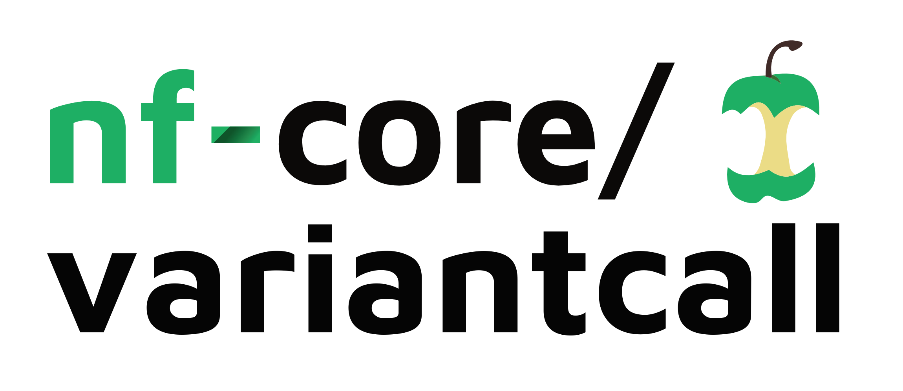




<hr>
<center>This is part 15 of <a href="/nextflow_varcal/nextflow/" target="_blank">Introduction to NextFlow</a>.</center>
<hr>

<br>

## NF-Core VariantCall



## Using the nf-core template

* The heart of nf-core is the standardisation of pipeline code structure. To achieve this, all pipelines adhere to a generalised pipeline template. 
* The best way to build an nf-core pipeline is to start by using this template via the `nf-core create` command.
* To initiaite a nextflow pipeline in nf-core style and pre-loaded templates and configuration, we can use `nf-core create` command:

```bash
nf-core create
```

You will prompted to enter `Workflow Name`, `Description`, `Author`. This will Initialise a pipeline git repository in your current directory. 

>```bash
>
>                                          ,--./,-.
>          ___     __   __   __   ___     /,-._.--~\
>    |\ | |__  __ /  ` /  \ |__) |__         }  {
>    | \| |       \__, \__/ |  \ |___     \`-._,-`-,
>                                          `._,._,'
>
>    nf-core/tools version 2.2
>
>
>
>Workflow Name: variantcall
>Description: simple variant calling workflow
>Author: Sateesh Peri
>INFO     Creating new nf-core pipeline: 'nf-core/variantcall'                                                                                                 create.py:67
>INFO     Initialising pipeline git repository                                                                                                                create.py:167
>INFO     Done. Remember to add a remote and push to GitHub:                                                                                                  create.py:174
          >cd /workspace/nextflow_tutorial/nf-core-variantcall                                                                                                             
          >git remote add origin git@github.com:USERNAME/REPO_NAME.git                                                                                                     
          >git push --all origin                                                                                                                                           
>INFO     This will also push your newly created dev branch and the TEMPLATE branch for syncing.                                                              create.py:180
>INFO     !!!!!! IMPORTANT !!!!!!                                                                                                                              create.py:58
                                                                                                                                                           >               
         >If you are interested in adding your pipeline to the nf-core community,                                                                                          
         >PLEASE COME AND TALK TO US IN THE NF-CORE SLACK BEFORE WRITING ANY CODE!                                                                                         
>```

```bash
cd nf-core-variantcall/
ls
```


## NF-Core Modules

* **[NF-Core Modules](https://nf-co.re/modules)**


* The Nextflow DSL2 syntax allows the modularizing of Nextflow pipelines, so workflows, subworkflows and modules can be defined and imported into a pipeline. This allows for the sharing of pipeline processes (modules, and also routine subworkflows) among nf-core pipelines.
* Shared modules are stored in the **[nf-core/modules](https://github.com/nf-core/modules)** repository. 
  * Modules on this repository are as atomic as possible, in general calling each one tool only.
  * If a tool consists of several subtools (e.g. `bwa index` and `bwa mem`), these will be stored in individual modules with the naming convention `tool/subtool`.
  * Each module defines the input and output channels, the process script, as well as the software packaging for a specific process.
  * Conda environments, docker or singularity containers are defined within each module. We mostly rely on the [biocontainers](https://biocontainers.pro/) project for providing single-tool containers for each module.


* The `nf-core/modules` repository also includes defined tests for each module which run on tiny test data on the `nf-core/test-datasets` repository (modules branch). The modules tests run in a similar way as pipeline tests on GitHub actions and ensure that modules are always functional and produce the desired results.

* nf-core tools have a series of subcommands to work with nf-core modules. 

* To list all the modules that are available in the `nf-core/modules` repository with the following command:

```bash
nf-core modules list remote
```

* To list all the currently installed modules in the pipeline:

```bash
nf-core modules list local
```

> The template pipeline comes with `fastqc`, `multiqc` and `custom/dumpsoftwareversions` pre-installed

```bash
┏━━━━━━━━━━━━━━━━━━━━━━━━━━━━━┳━━━━━━━━━━━━━━━━━┳━━━━━━━━━━━━━━━━━━━━━━━━━━━━━━━━━━━━━━━━━━┳━━━━━━━━━━━━━━━━━━━━━━━━━━━━━━━━━━━━━━━━━━━━━━━━━━━━━━━━━━━━━━━━━━━━━━━━━━━━━━┳━━━━━━━━━━━━┓
┃ Module Name                 ┃ Repository      ┃ Version SHA                              ┃ Message                                                                      ┃ Date       ┃
┡━━━━━━━━━━━━━━━━━━━━━━━━━━━━━╇━━━━━━━━━━━━━━━━━╇━━━━━━━━━━━━━━━━━━━━━━━━━━━━━━━━━━━━━━━━━━╇━━━━━━━━━━━━━━━━━━━━━━━━━━━━━━━━━━━━━━━━━━━━━━━━━━━━━━━━━━━━━━━━━━━━━━━━━━━━━━╇━━━━━━━━━━━━┩
│ custom/dumpsoftwareversions │ nf-core/modules │ 20d8250d9f39ddb05dfb437603aaf99b5c0b2b41 │ Update all modules to new NF DSL2 syntax (#1099)                             │ 2021-11-26 │
│ fastqc                      │ nf-core/modules │ 9d0cad583b9a71a6509b754fdf589cbfbed08961 │ Change syntax from task.ext.suffix to tast.ext.prefix in all modules (#1110) │ 2021-12-02 │
│ multiqc                     │ nf-core/modules │ 20d8250d9f39ddb05dfb437603aaf99b5c0b2b41 │ Update all modules to new NF DSL2 syntax (#1099)                             │ 2021-11-26 │
└─────────────────────────────┴─────────────────┴──────────────────────────────────────────┴──────────────────────────────────────────────────────────────────────────────┴────────────┘
```

* Create a samplesheet from untrimmed-reads: `code samplesheet.csv` paste the following and save


```bash
sample,fastq_1,fastq_2
SRR2584863,/workspace/nextflow_tutorial/data/untrimmed_fastq/SRR2584863_1.fastq.gz,/workspace/nextflow_tutorial/data/untrimmed_fastq/SRR2584863_2.fastq.gz
SRR2584866,/workspace/nextflow_tutorial/data/untrimmed_fastq/SRR2584866_1.fastq.gz,/workspace/nextflow_tutorial/data/untrimmed_fastq/SRR2584866_2.fastq.gz
SRR2589044,/workspace/nextflow_tutorial/data/untrimmed_fastq/SRR2589044_1.fastq.gz,/workspace/nextflow_tutorial/data/untrimmed_fastq/SRR2589044_2.fastq.gz
```

* Change the `max_memory` and `max_cpus` available in `nextflow.config` file:

```groovy
max_memory                 = '6.GB'
max_cpus                   = 4
```

* To run the workflow with `fastqc`, `multiqc` and `dumpsoftwareversions` processes

```bash
nextflow run main.nf --input samplesheet.csv --fasta /workspace/nextflow_tutorial/data/ref_genome/ecoli_rel606.fasta -profile docker
```


>```bash
>N E X T F L O W  ~  version 21.10.6
>Launching `main.nf` [admiring_torvalds] - revision: 55a600f0ab
>
>
>------------------------------------------------------
>                                        ,--./,-.
>        ___     __   __   __   ___     /,-._.--~'
>  |\ | |__  __ /  ` /  \ |__) |__         }  {
>  | \| |       \__, \__/ |  \ |___     \`-._,-`-,
>                                        `._,._,'
>  nf-core/variantcall v1.0dev
>------------------------------------------------------
>Core Nextflow options
>  runName        : admiring_torvalds
>  containerEngine: docker
>  launchDir      : /workspace/nextflow_tutorial/nf-core-variantcall
>  workDir        : /workspace/nextflow_tutorial/nf-core-variantcall/work
>  projectDir     : /workspace/nextflow_tutorial/nf-core-variantcall
>  userName       : gitpod
>  profile        : docker
>  configFiles    : /workspace/nextflow_tutorial/nf-core-variantcall/nextflow.config
>
>Input/output options
>  input          : samplesheet.csv
>
>Reference genome options
>  fasta          : /workspace/nextflow_tutorial/data/ref_genome/ecoli_rel606.fasta
>
>Max job request options
>  max_cpus       : 4
>  max_memory     : 12.GB
>
>!! Only displaying parameters that differ from the pipeline defaults !!
>------------------------------------------------------
>If you use nf-core/variantcall for your analysis please cite:
>
>* The nf-core framework
>  https://doi.org/10.1038/s41587-020-0439-x
>
>* Software dependencies
>  https://github.com/nf-core/variantcall/blob/master/CITATIONS.md
>------------------------------------------------------
>executor >  local (6)
>[60/43ab20] process > NFCORE_VARIANTCALL:VARIANTCALL:INPUT_CHECK:SAMPLESHEET_CHECK (samplesheet.csv) [100%] 1 of 1 ✔
>[27/2aadda] process > NFCORE_VARIANTCALL:VARIANTCALL:FASTQC (SRR2589044_T1)                          [100%] 3 of 3 ✔
>[26/e03e88] process > NFCORE_VARIANTCALL:VARIANTCALL:CUSTOM_DUMPSOFTWAREVERSIONS (1)                 [100%] 1 of 1 ✔
>[de/019672] process > NFCORE_VARIANTCALL:VARIANTCALL:MULTIQC                                         [100%] 1 of 1 ✔
>-[nf-core/variantcall] Pipeline completed successfully-
>WARN: To render the execution DAG in the required format it is required to install Graphviz -- See http://www.graphviz.org for more info.
>Completed at: 21-Feb-2022 14:46:30
>Duration    : 1m 55s
>CPU hours   : 0.1
>Succeeded   : 6
>```

* To clean any previous nextflow runs:

```bash
rm -fr results/ work/ .nextflow .nextflow.log*
```


## Adding nf-core modules to a pipeline

To filter the search:

```bash
nf-core modules list remote | grep bwa
nf-core modules list remote | grep samtools
nf-core modules list remote | grep bcftools
```

Adding nf-core modules to a pipeline, if the modules already exist in the nf-core modules repository, can be done with the following command (executing it in the main pipeline directory):

>```bash
>nf-core modules install <module name>
>```

```bash
nf-core modules install bwa/index
```

```bash

                                          ,--./,-.
          ___     __   __   __   ___     /,-._.--~\
    |\ | |__  __ /  ` /  \ |__) |__         }  {
    | \| |       \__, \__/ |  \ |___     \`-._,-`-,
                                          `._,._,'

    nf-core/tools version 2.1


INFO     Installing 'bwa/index'                                                                                                   install.py:127
INFO     Downloaded 2 files to ./modules/nf-core/modules/bwa/index                                                        modules_command.py:268
```

```bash
nf-core modules install bwa/mem
```

```bash
nf-core modules install samtools/sort
```

```bash
nf-core modules install samtools/index
```

```bash
nf-core modules install bcftools/mpileup
```

* The modules files will be added under the `modules/nf-core` directory. To be able to call the module inside the main pipeline workflow (such as workflows/<pipeline-name>.nf) or a sub-workflow, an include statement needs to be added in the corresponding Nextflow file:

>```bash
>include { TOOL_SUBTOOL } from '../modules/nf-core/modules/<tool/subtool>/main'
>```

*  Add the following to `nf-core-variantcall/workflows/variantcall.nf`

```groovy
include { BWA_INDEX                   } from '../modules/nf-core/modules/bwa/index/main'
include { BWA_MEM                     } from '../modules/nf-core/modules/bwa/mem/main'
include { SAMTOOLS_SORT               } from '../modules/nf-core/modules/samtools/sort/main'
include { SAMTOOLS_INDEX              } from '../modules/nf-core/modules/samtools/index/main'
include { BCFTOOLS_MPILEUP            } from '../modules/nf-core/modules/bcftools/mpileup/main'
```

*  Add the following to `nf-core-variantcall/workflows/variantcall.nf` within workflow scope

```groovy
    //
    // MODULE: Run BWA-INDEX
    //

    BWA_INDEX(params.fasta)

    //
    // MODULE: Run BWA-ALIGN
    //

    BWA_MEM(INPUT_CHECK.out.reads, BWA_INDEX.out.index, "view")

    //
    // MODULE: Run SAMTOOLS-SORT
    //

    SAMTOOLS_SORT(BWA_MEM.out.bam)

    //
    // MODULE: Run SAMTOOLS-INDEX
    //

    SAMTOOLS_INDEX(SAMTOOLS_SORT.out.bam)
```


* Tool options or other options that should be passed to the module can be defined in the `nf-core-variantcall/conf/modules.config` configuration file.
* Append the following to `nf-core-variantcall/conf/modules.config` within process scope:

```bash
withName: SAMTOOLS_SORT {
  ext.prefix = "sorted"
}
```

```bash
nextflow run main.nf --input samplesheet.csv --fasta /workspace/nextflow_tutorial/data/ref_genome/ecoli_rel606.fasta -profile docker
```
 
>Output
>```bash
>N E X T F L O W  ~  version 21.10.6
>Launching `main.nf` [magical_einstein] - revision: 55a600f0ab
>
>
>------------------------------------------------------
>                                        ,--./,-.
>        ___     __   __   __   ___     /,-._.--~'
>  |\ | |__  __ /  ` /  \ |__) |__         }  {
>  | \| |       \__, \__/ |  \ |___     \`-._,-`-,
>                                        `._,._,'
>  nf-core/variantcall v1.0dev
>------------------------------------------------------
>Core Nextflow options
>  runName        : magical_einstein
>  containerEngine: docker
>  launchDir      : /workspace/nextflow_tutorial/nf-core-variantcall
>  workDir        : /workspace/nextflow_tutorial/nf-core-variantcall/work
>  projectDir     : /workspace/nextflow_tutorial/nf-core-variantcall
>  userName       : gitpod
>  profile        : docker
>  configFiles    : /workspace/nextflow_tutorial/nf-core-variantcall/nextflow.config
>
>Input/output options
>  input          : samplesheet.csv
>
>Reference genome options
>  fasta          : /workspace/nextflow_tutorial/data/ref_genome/ecoli_rel606.fasta
>
>Max job request options
>  max_cpus       : 4
>  max_memory     : 6.GB
>
>!! Only displaying parameters that differ from the pipeline defaults !!
>------------------------------------------------------
>If you use nf-core/variantcall for your analysis please cite:
>
>* The nf-core framework
>  https://doi.org/10.1038/s41587-020-0439-x
>
>* Software dependencies
>  https://github.com/nf-core/variantcall/blob/master/CITATIONS.md
>------------------------------------------------------
>executor >  local (16)
>[3f/2fccb5] process > NFCORE_VARIANTCALL:VARIANTCALL:INPUT_CHECK:SAMPLESHEET_CHECK (samplesheet.csv) [100%] 1 of 1 ✔
>[23/776fe6] process > NFCORE_VARIANTCALL:VARIANTCALL:FASTQC (SRR2584863_T1)                          [100%] 3 of 3 ✔
>[2e/2d108b] process > NFCORE_VARIANTCALL:VARIANTCALL:CUSTOM_DUMPSOFTWAREVERSIONS (1)                 [100%] 1 of 1 ✔
>[59/7e75bb] process > NFCORE_VARIANTCALL:VARIANTCALL:BWA_INDEX (ecoli_rel606.fasta)                  [100%] 1 of 1 ✔
>[ce/50d7ee] process > NFCORE_VARIANTCALL:VARIANTCALL:BWA_MEM (SRR2584866_T1)                         [100%] 3 of 3 ✔
>[56/dae396] process > NFCORE_VARIANTCALL:VARIANTCALL:SAMTOOLS_SORT (SRR2584866_T1)                   [100%] 3 of 3 ✔
>[90/5ac8a9] process > NFCORE_VARIANTCALL:VARIANTCALL:SAMTOOLS_INDEX (SRR2584866_T1)                  [100%] 3 of 3 ✔
>[40/2df600] process > NFCORE_VARIANTCALL:VARIANTCALL:MULTIQC                                         [100%] 1 of 1 ✔
>-[nf-core/variantcall] Pipeline completed successfully-
>WARN: To render the execution DAG in the required format it is required to install Graphviz -- See http://www.graphviz.org for more info.
>Completed at: 04-Mar-2022 01:57:43
>Duration    : 5m 30s
>CPU hours   : 0.3
>Succeeded   : 16          
>```
    
          
---

<h5><a href="/nextflow_varcal/nextflow/nextflow_caching" style="float: left"><b>Back to:</b>NextFlow Caching</a>

<a href="/nextflow_varcal/nextflow/index" style="float: right"><b>Next:</b>Table of Contents</a></h5>
