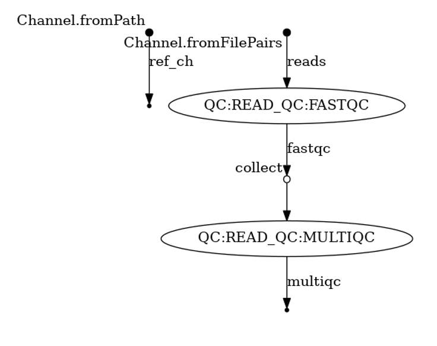




<hr>
<center>This is part 12 of 14 of a <a href="/nextflow_varcal/nextflow/" target="_blank">Introduction to NextFlow</a>.</center>
<hr>

<br>

## Sub-workflows

* We have seen previously the Nextflow DSL2 syntax allows for the definition of reusable processes (modules).

* Nextflow DSL2 also allow the definition reusable sub-workflow libraries.

### Workflow definition

*   The `workflow` keyword allows the definition of workflow components that enclose the invocation of one or more processes and operators.

> **Implicit workflow** : A workflow definition which does not declare any name is assumed to be the main workflow, and it is implicitly executed. Therefore it’s the entry point of the workflow application.

* A workflow component can access any variable and parameter defined in the outer scope.

* A workflow component can declare one or more input channels using the `take` keyword.

> Warning: When the `take` keyword is used, the beginning of the workflow body needs to be identified with the `main` keyword. Then, the input can be specified as an argument in the workflow invocation statement:

*   These input channels can then be passed to the workflow as parameters inside the `()`. Multiple parameters are separated by a comma `,` and must be specified in the order they appear under `take:`

> Note: Workflow inputs are by definition channel data structures. If a basic data type is provided instead, ie. number, string, list, etc. it’s implicitly converted to a channel value (ie. non-consumable).

*   A workflow component can declare one or more output channels using the `emit` keyword.

> Note: Implicit workflow definition is ignored when a script is included as module. This allows the writing a workflow script that can be used either as a library module and as application script.

*   As with modules workflows components can be defined within your script or imported by a `include` statment. After which thet can then be invoked and composed as any other workflow component or process in your script.


Let's create a sub-workflow for read qc using `fastqc` and `multiqc` modules.

*    First, we need to create a new file `multiqc.nf` in the `/workspace/nextflow_tutorial/modules/` directory; paste the following and save.

```groovy
/*
========================================================================================
    MULTIQC module
========================================================================================
    Website: https://multiqc.info/
========================================================================================
*/

// Parameter definitions
params.CONTAINER = "quay.io/biocontainers/multiqc:1.9--pyh9f0ad1d_0"
params.OUTPUT = "multiqc_output"

process MULTIQC {

    // where to store the results and in which way
    publishDir(params.OUTPUT, mode: 'copy')

    // indicates to use as a container the value indicated in the parameter
    container( params.CONTAINER )
    
    // show in the log which input file is analysed
    tag( "${inputfiles}" )

    input:
    path( inputfiles )

    output:
    path "multiqc_report.html", emit: multiqc_report

    script:
    """
         multiqc .
    """
}
```

*   Now, let's create a new directory for subworkflows


```bash
cd ~/nextflow_tutorial/
mkdir subworkflows
cd subworkflows
```

*   Create a new file `fastmultiqc.nf` in `/workspace/nextflow_tutorial/subworkflows` directory; paste the following and save.

```groovy
/*
========================================================================================
    READ QC Sub-Workflow
========================================================================================
*/

/*
========================================================================================
    Include Modules
========================================================================================
*/

include { FASTQC } from "../modules/fastqc"
include { MULTIQC } from "../modules/multiqc"

/*
========================================================================================
    Workflow READ_QC
========================================================================================
*/

workflow READ_QC {
    take:
      reads

    main:
      FASTQC(reads)
      MULTIQC(FASTQC.out.collect())

    emit:
      fastqc  = FASTQC.out.fastqc_out
      multiqc = MULTIQC.out.multiqc_report
}
```

*   Move to parent directory

```bash
cd /workspace/nextflow_tutorial
```

* Replace your `variant-calling.nf` script as shown below to include the `QC` sub-workflow

```groovy
/*
========================================================================================
    Variant-Calling Nextflow Workflow
========================================================================================
    Github   : 
    Contact  :     
----------------------------------------------------------------------------------------
*/

nextflow.enable.dsl=2

println """\
         V A R I A N T-C A L L I N G - N F   P I P E L I N E
         ===================================
         genome       : ${params.genome}
         reads        : ${params.reads}
         outdir       : ${params.outdir}
         """
         .stripIndent()

/*
========================================================================================
    Include Modules
========================================================================================
*/

include { BWA_INDEX  }                                from "./modules/bwa_index" addParams(OUTPUT: "${params.outdir}/bwa_index")
include { BWA_ALIGN  }                                from "./modules/bwa_align" addParams(OUTPUT: "${params.outdir}/bwa_align")
include { SAMTOOLS_SORT; SAMTOOLS_INDEX }             from "./modules/samtools"  addParams(OUTPUT: "${params.outdir}/sorted_bam")
include { BCFTOOLS_MPILEUP; BCFTOOLS_CALL; VCFUTILS } from "./modules/bcftools"  addParams(OUTPUT: "${params.outdir}/vcf")

/*
========================================================================================
    Include Sub-Workflows
========================================================================================
*/

include { READ_QC } from "./subworkflows/fastmultiqc" addParams(OUTPUT: "${params.outdir}/read_qc")

/*
========================================================================================
    Create Channels
========================================================================================
*/

ref_ch = Channel.fromPath( params.genome, checkIfExists: true  )  
reads_ch = Channel.fromFilePairs( params.reads, checkIfExists: true ) 

/*
========================================================================================
    WORKFLOW - Variant Calling
========================================================================================
*/

workflow QC {

    READ_QC( reads_ch )
    
}

workflow {

    READ_QC( reads_ch )
    BWA_INDEX( ref_ch )
    BWA_ALIGN( BWA_INDEX.out.bwa_index.combine(reads_ch) )
    SAMTOOLS_SORT( BWA_ALIGN.out.aligned_bam )
    SAMTOOLS_INDEX( SAMTOOLS_SORT.out.sorted_bam )
    BCFTOOLS_MPILEUP( BWA_INDEX.out.bwa_index.combine(SAMTOOLS_INDEX.out.aligned_sorted_bam) )
    BCFTOOLS_CALL( BCFTOOLS_MPILEUP.out.raw_bcf )
    VCFUTILS( BCFTOOLS_CALL.out.variants_vcf )

}

workflow.onComplete {

    println ( workflow.success ? """
        Pipeline execution summary
        ---------------------------
        Completed at: ${workflow.complete}
        Duration    : ${workflow.duration}
        Success     : ${workflow.success}
        workDir     : ${workflow.workDir}
        exit status : ${workflow.exitStatus}
        """ : """
        Failed: ${workflow.errorReport}
        exit status : ${workflow.exitStatus}
        """
    )
}

/*
========================================================================================
    THE END
========================================================================================
*/
```

*   Make sure your `nextflow.config` matches below to be able to submit to the cluster

```groovy
/*
========================================================================================
    Custom Config File
========================================================================================
    Default config options for HPC compute environments
----------------------------------------------------------------------------------------
*/

//Profile config names for nf-core/configs

params {

  config_profile_description = ''
  config_profile_contact     = ''
  config_profile_url         = ''

  // Input parameters

  genome                     = "${launchDir}/data/ref_genome/ecoli_rel606.fasta"
  reads                      = "${launchDir}/data/trimmed_fastq/*_{1,2}.trim.fastq.gz"
  
  // Output options
  outdir                     = "results"
}

/*
========================================================================================
    Nextflow Metrics & Reports
========================================================================================
*/

timeline {
  enabled = true
  file    = "${params.outdir}/timeline.html"
}

report {
  enabled = true
  file    = "${params.outdir}/report.html"
}
trace {
  enabled = true
  fields  = 'task_id,name,status,exit,realtime,%cpu,%mem,rss,vmem,peak_rss,peak_vmem,rchar,wchar'
  file    = "${params.outdir}/trace.txt"
}

/*
========================================================================================
    Base Executor config
========================================================================================
*/

executor {
  queueSize = 2
}

/*
========================================================================================
    Profiles - slurm,singularity,conda
========================================================================================
*/

profiles {
  sge {
    process {
      executor     = 'slurm'
      queue        = 'my.q'
    }
    executor {
      queueSize    = 100
      pollInterval = '15 sec'
    }
  }

  conda {
    process.conda = "${launchDir}/environment.yml"
  }
  
  singularity {
    singularity.enabled = true
  }

}
```

## Specific workflow entry points

By default, the unnamed workflow is assumed to be the main entry point for the script. Using named workflows, the entry point can be customised by using the `-entry` option of the run command. This allows users to run a specific sub-workflow or a section of their entire workflow script.

For example:

```bash
nextflow run variant-calling.nf -profile singularity,slurm -entry QC -with-dag read_qc_dag.png
```

>Output
>```bash
>executor >  slurm (6)
>[a5/272a18] process > QC:READ_QC:FASTQC ([SRR2584866_1.trim.fastq.gz, SRR2584866_2.tri... [100%] 3 of 3 ✔
>[af/1182f5] process > QC:READ_QC:MULTIQC ([SRR2584866_1.trim_fastqc.html, SRR2584866_1... [100%] 3 of 3 ✔
>
>        Pipeline execution summary
>        ---------------------------
>        Completed at: 2022-01-25T21:08:58.189-05:00
>        Duration    : 1m 47s
>        Success     : true
>        workDir     : nextflow_tutorial/work
>
>```




> `tree results/`
>```bash
>results/
>├── read_qc
>│   ├── multiqc_report.html
>│   ├── SRR2584863_1.trim_fastqc.html
>│   ├── SRR2584863_1.trim_fastqc.zip
>│   ├── SRR2584863_2.trim_fastqc.html
>│   ├── SRR2584863_2.trim_fastqc.zip
>│   ├── SRR2584866_1.trim_fastqc.html
>│   ├── SRR2584866_1.trim_fastqc.zip
>│   ├── SRR2584866_2.trim_fastqc.html
>│   ├── SRR2584866_2.trim_fastqc.zip
>│   ├── SRR2589044_1.trim_fastqc.html
>│   ├── SRR2589044_1.trim_fastqc.zip
>│   ├── SRR2589044_2.trim_fastqc.html
>│   └── SRR2589044_2.trim_fastqc.zip
>├── report.html
>├── timeline.html
>└── trace.txt
>
>1 directory, 16 files
>```

> **[Click here for another good example on using sub-workflows](https://nextflow-io.github.io/elixir-workshop-21/docs/fourth.html#bowtie)**

> Quick Recap
>*  Nextflow allows for definition of reusable sub-workflow libraries.
>*  Sub-workflow allows the definition of workflow processes that can be included from any other script and invoked as a custom function within the new workflow scope. This enables reuse of workflow components
>*  The `-entry` option of the nextflow run command specifies the workflow name to be executed


---

<h5><a href="/nextflow_varcal/nextflow/nextflow_modules" style="float: left"><b>Back to:</b>NextFlow Modules</a>

<a href="/nextflow_varcal/nextflow/nextflow_reporting" style="float: right"><b>Next:</b>NextFlow Reporting</a></h5>
