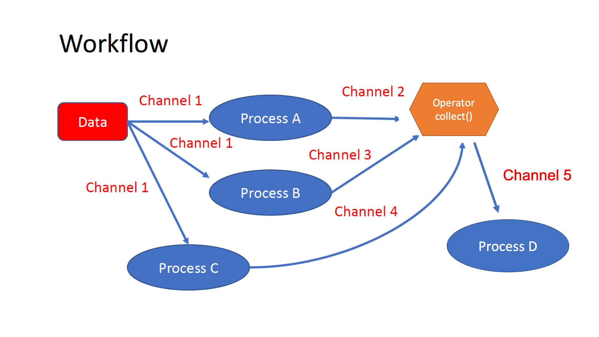




<hr>
<center>This is part 7 of 14 of a <a href="/nextflow_varcal/nextflow/" target="_blank">Introduction to NextFlow</a>.</center>
<hr>

<br>

```bash
cd ~/nextflow_tutorial
mkdir workflow
cd workflow
conda activate varcal
```

Our previous episodes have shown us how to parameterise workflows using `params`, move data around a workflow using `channels` and define individual tasks using `processes`. In this episode we will cover how connect multiple processes to create a workflow.



*   The workflows can be represented as graphs where the nodes are the `processes` and the edges are the `channels`. The processes are blocks of code that can be executed - such as scripts or programs - while the channels are asynchronous queues able to connect processes among them via input / output. Some methods, called `operators` are provided for reshaping and combining the channels.

*   Processes are independent from each another and can be run in parallel, depending on the number of elements in a channel. In the previous example, processes **A**, **B** and **C** can be run in parallel and only when they **ALL** end the process **D** is triggered. An operator is used for gathering together all the elements generated by the channels **2**, **3** and **4**.

### Workflow definition

* We can connect processes to create our pipeline inside a `workflow` scope. The workflow scope starts with the keyword `workflow`, followed by an optional name and finally the workflow body delimited by curly brackets `{}`.

> **Implicit workflow** - A workflow definition which does not declare any name is assumed to be the main workflow, and it is implicitly executed. Therefore it’s the entry point of the workflow application.

* **To combine multiple processes invoke them in the order they would appear in a workflow.**
* **When invoking a process with multiple inputs, provide them in the same order in which they are declared in the `input` block of the process.**

* A workflow component can access any variable and parameter defined in the outer scope. In the example below the `params.genome` and `params.reads` be accessed inside the `workflow` scope:

**Create a new `workflow.nf`; add the following code block and `nextflow run workflow.nf`:**

```groovy
//workflow.nf
nextflow.enable.dsl=2

// Initialize required parameters
params.outdir = 'results'
params.genome = "$HOME/nextflow_tutorial/data/ref_genome/ecoli_rel606.fasta"
params.reads = "$HOME/nextflow_tutorial/data/trimmed_fastq/SRR2584863_{1,2}.trim.fastq.gz"

workflow {
    
    // Create channel from path for Reference Genome
    ref_ch = Channel.fromPath( params.genome, checkIfExists: true )  
    // Create channel from file-pairs for Input Fastq files
    reads_ch = Channel.fromFilePairs( params.reads, checkIfExists: true ) 

    //index process takes 1 input channel as a argument
    BWA_INDEX( ref_ch )

    //bwa align process takes 2 input channels as arguments
    BWA_ALIGN( BWA_INDEX.out, reads_ch )
}

process BWA_INDEX {
  tag {"BWA_INDEX ${genome}"}
  label 'process_low'

  publishDir "${params.outdir}/bwa_index", mode: 'copy'
  
  input:
  path( genome )

  output:
  tuple path( genome ), path( "*" )

  script:
  """
  bwa index ${genome}
  """
}

/*
 * Align reads to reference genome & create BAM file.
 */
process BWA_ALIGN {
    tag {"BWA_ALIGN ${sample_id}"}
    label 'process_medium'

    publishDir "${params.outdir}/bwa_align", mode: 'copy'
    
    input:
    tuple path( genome ), path( "*" )
    tuple val( sample_id ), path( reads )

    output:
    tuple val( sample_id ), path( "${sample_id}.aligned.bam" )

    script:
    """
    INDEX=`find -L ./ -name "*.amb" | sed 's/.amb//'`
    bwa mem \$INDEX ${reads} > ${sample_id}.aligned.sam
    samtools view -S -b ${sample_id}.aligned.sam > ${sample_id}.aligned.bam
    """
}
```

* In this example, the `BWA_INDEX` process is invoked first and the `BWA_ALIGN` process second.

* A process output can also be accessed using the `out` attribute for the respective `process object`.

* The `BWA_INDEX.out` object, is passed as the first argument to the `BWA_ALIGN` process and the `reads_ch` channel is passed as the second argument (in the same order they are declared as inputs in the process).

* When a process defines two or more output channels, each of them can be accessed using the list element operator e.g. out[0], out[1], or using named outputs.

### Process named output

* The process `output` definition allows the use of the `emit:` option to define a **named identifier** that can be used to reference the channel in the external scope.

* For example in the script below we name the output from the `BWA_INDEX` process as `bwa_index` using the `emit:` option. We can then reference the output as `BWA_INDEX.out.bwa_index` in the workflow scope.

**Modify `workflow.nf` as shown below and `nextflow run workflow.nf`:**

```groovy
//workflow.nf
nextflow.enable.dsl=2

// Initialize required parameters
params.outdir = 'results'
params.genome = "$HOME/nextflow_tutorial/data/ref_genome/ecoli_rel606.fasta"
params.reads = "$HOME/nextflow_tutorial/data/trimmed_fastq/SRR2584863_{1,2}.trim.fastq.gz"

workflow {
    
    // Create channel from path for Reference Genome
    ref_ch = Channel.fromPath( params.genome, checkIfExists: true )  
    // Create channel from file-pairs for Input Fastq files
    reads_ch = Channel.fromFilePairs( params.reads, checkIfExists: true ) 

    //index process takes 1 input channel as a argument
    BWA_INDEX( ref_ch )

    //bwa align process takes 2 input channels as arguments
    BWA_ALIGN( BWA_INDEX.out.bwa_index, reads_ch )
}

process BWA_INDEX {
  tag {"BWA_INDEX ${genome}"}
  label 'process_low'

  publishDir "${params.outdir}/bwa_index", mode: 'copy'
  
  input:
  path( genome )

  output:
  tuple path( genome ), path( "*" ), emit: bwa_index

  script:
  """
  bwa index ${genome}
  """
}

/*
 * Align reads to reference genome & create BAM file.
 */
process BWA_ALIGN {
    tag {"BWA_ALIGN ${sample_id}"}
    label 'process_medium'

    publishDir "${params.outdir}/bwa_align", mode: 'copy'
    
    input:
    tuple path( genome ), path( "*" )
    tuple val( sample_id ), path( reads )

    output:
    tuple val( sample_id ), path( "${sample_id}.aligned.bam" ), emit: aligned_bam

    script:
    """
    INDEX=`find -L ./ -name "*.amb" | sed 's/.amb//'`
    bwa mem \$INDEX ${reads} > ${sample_id}.aligned.sam
    samtools view -S -b ${sample_id}.aligned.sam > ${sample_id}.aligned.bam
    """
}
```

---

> Quick Recap
>*  A Nextflow workflow is defined by invoking `processes` inside the `workflow` scope.
>*  A process is invoked like a function inside the `workflow` scope passing any required input parameters as arguments. e.g. `BWA_INDEX( ref_ch )`.
>*  Process outputs can be accessed using the `out` attribute for the respective `process`. 
>*  Multiple outputs from a single process can be accessed using the `[]` or output name.

---

<h5><a href="/nextflow_varcal/nextflow/nextflow_processes" style="float: left"><b>Back to:</b>Nextflow Processes</a>

<a href="/nextflow_varcal/nextflow/nextflow_operators" style="float: right"><b>Next:</b>NextFlow Operators</a></h5>
