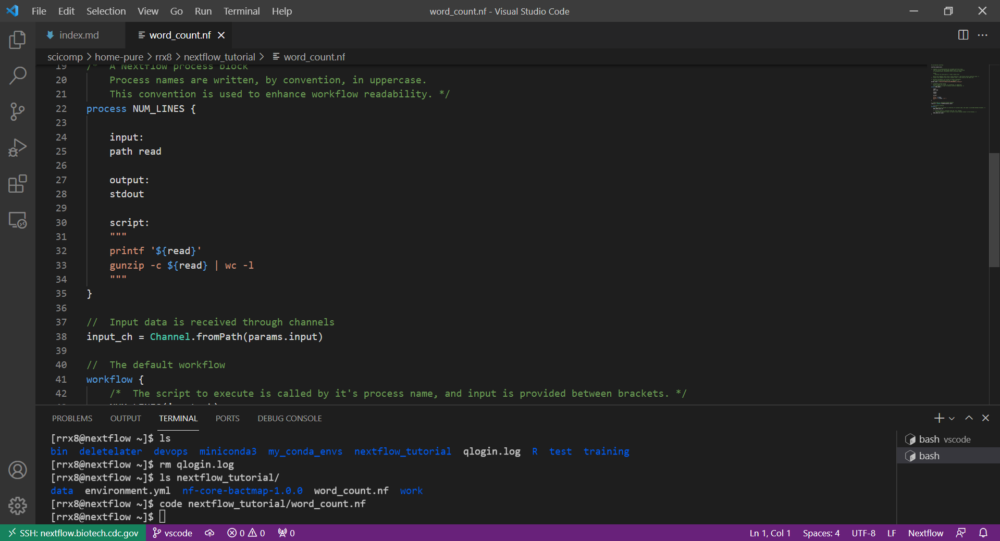

---

**Visual Studio Code is a lightweight but powerful source code editor which runs on your desktop and is available for Windows, macOS and Linux**

 

## Content

| Lessons            | Estimated Duration |
|:------------------------|:----------|
|[Introduction to VS-Code](/vscode/vscode_intro) | 5 min |
|[VS-Code Install](/vscode/vscode_install) | 5 min |
|[VS-Code Remote SSH](/vscode/vscode_remote_ssh) | 10 min |
|[VS-Code Useful Links](/vscode/vscode_useful) |  |