


<hr>
<center>This is part 2 of 3 of a <a href="/vscode/" target="_blank">Introduction to VS-Code</a>.</center>
<hr>

<br>

## Install the extension

The Remote - SSH extension is used to connect to SSH hosts.

* Open VS-Code
*   **[Install the Remote - SSH extension by clicking here](vscode:extension/ms-vscode-remote.remote-ssh)**

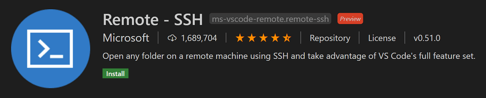   

*   With the Remote - SSH extension installed, you will see a new Status bar item at the far left.


*   The Remote Status bar item can quickly show you in which context VS Code is running (local or remote) and clicking on the item will bring up the Remote - SSH commands.

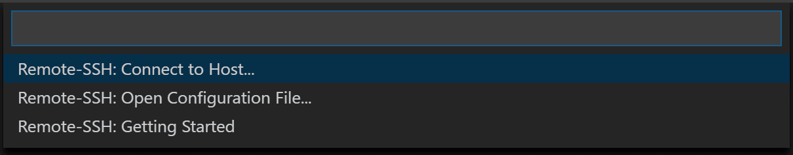


## Set up SSH

(ignore if you have already created SSH key-pair)

*   There are several authentication methods into a VM, including an `SSH public/private` key pair or a username and password. We strongly recommend using key-based authentication (if you use a username/password, you'll be prompted to enter your credentials more than once by the extension). If you're on Windows and have already created keys using PuttyGen, you can reuse them.

* Open a Powershell in VSCode by clicking on `New Terminal`

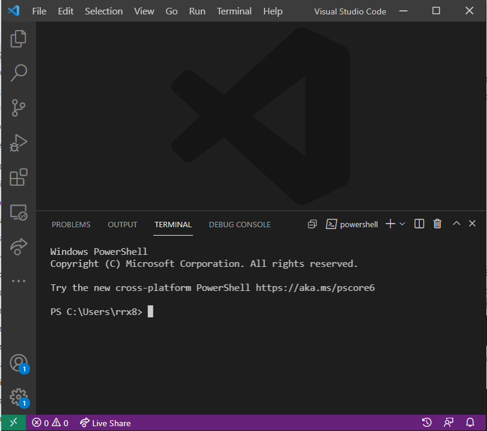

**Create an SSH key**

If you don't have an SSH key pair, open a bash shell or Powershell and type in:

```bash
ssh-keygen -t rsa -b 2048
```

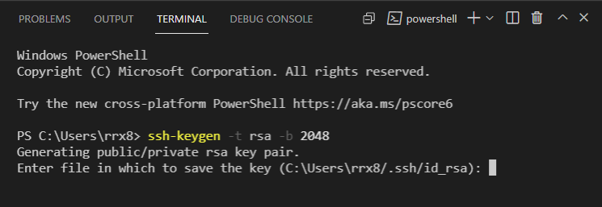

*   A `private key`, is usually named `id_rsa`. The private key is stored on your local computer and should be kept secure, with permissions set so that no other users on your computer can read the file.
*    A `public key`, is usually named `id_rsa.pub`. The public key is placed on the server you intend to log in to. You can freely share your public key with others. If someone else adds your public key to their server, you will be able to log in to that server.


```bash
$USER_AT_HOST="<user>@<remote-server>"
$PUBKEYPATH="$HOME\.ssh\id_rsa.pub"
 
$pubKey=(Get-Content "$PUBKEYPATH" | Out-String); ssh "$USER_AT_HOST" "mkdir -p ~/.ssh && chmod 700 ~/.ssh && echo '${pubKey}' >> ~/.ssh/authorized_keys && chmod 600 ~/.ssh/authorized_keys"
```

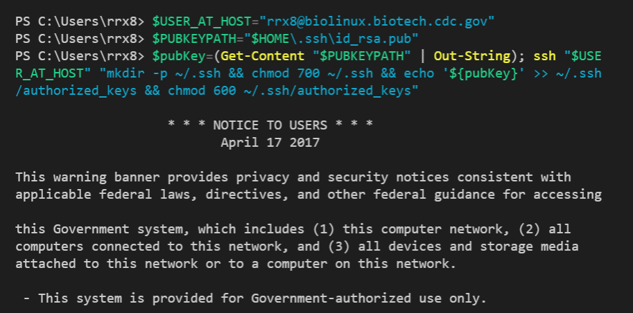

---
<br>

## Connect to Remote SSH Host

**Click on the green button on the bottom-left of the VS-Code**

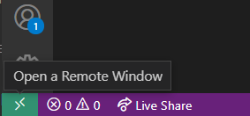

**Select `Add a new SSH Host` in the bar displayed**

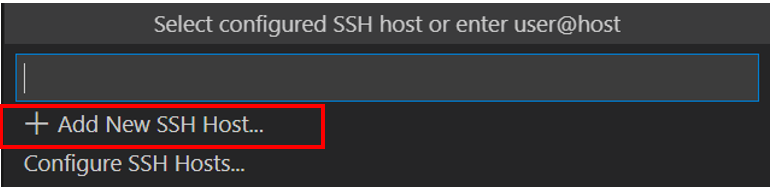

**Enter the ssh command `ssh <user>@<remote-server>` replacing with your CDC id**

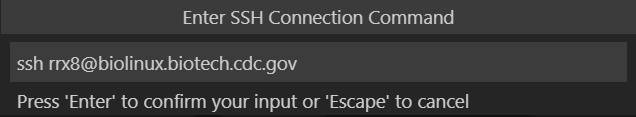

**Select the config file to use**

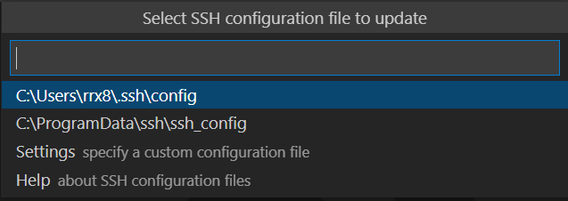

**Now you will see that the host has been added**

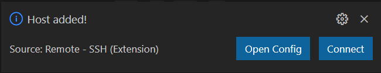

**Now you can click on the `Remote Explorer` button on the left pane of VS-Code and you can see a list of ssh hosts added**

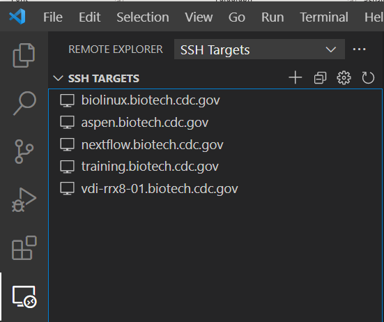

**Choose a host to connect to and connect either in current window or a new one**

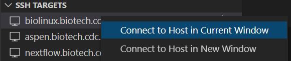

**Once the ssh host has been connected you can open a terminal from the main menu on the top**


---

<h5><a href="/vscode/index" style="float: left"><b>Back to:</b>Table of Contents</a>

<a href="/vscode/vscode_useful" style="float: right"><b>Next:</b>VS-Code Useful Links</a></h5>